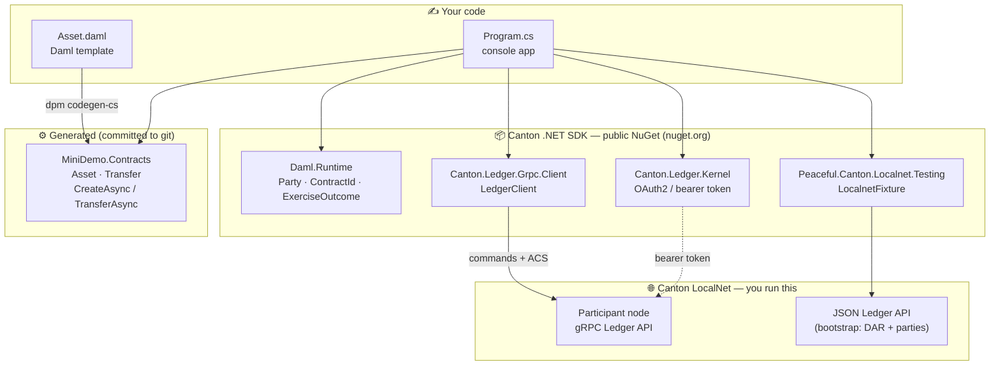
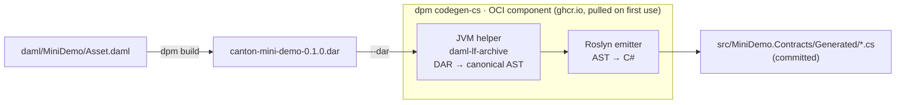
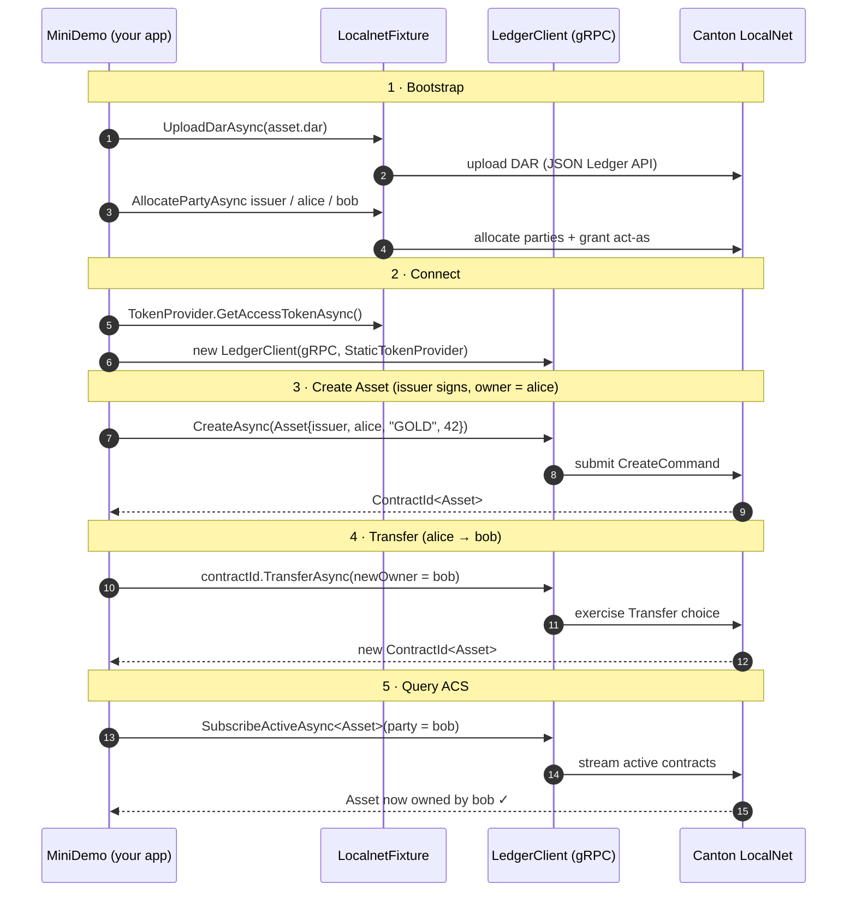

# Canton .NET SDK — Mini Demo

> The smallest possible program that takes a Canton smart contract from **Daml source → generated C# → live ledger round-trip**, end to end, against a running Canton LocalNet.

<p>
  <a href="https://github.com/peacefulstudio/canton-dotnet-sdk-mini-demo/actions/workflows/ci.yaml"></a>
  
  
  
  
</p>

This repository is the **quickstart and end-to-end integration test** for the **C# / .NET SDK for
Canton Network**. It is deliberately tiny — **one** Daml template, **one** console program, no DI or
telemetry weight — so the whole SDK story fits on one screen and a new developer can run it in
minutes.

It demonstrates the three things every Canton .NET application needs:

| # | Capability | In this demo |
|---|------------|--------------|
| 1 | **Codegen** — turn a Daml contract into idiomatic, strongly-typed C# | `dpm build` + `dpm codegen-cs` → `src/MiniDemo.Contracts/Generated/` |
| 2 | **Command submission** — create a contract and exercise a choice over the gRPC Ledger API | generated `CreateAsync(...)` / `TransferAsync(...)` on a `LedgerClient` |
| 3 | **ACS query** — read the active contract set back | typed `LedgerClient.SubscribeActiveAsync<Asset>`, filtered to the `Asset` template |

The scenario is a two-party ownership transfer: an `Asset` is created with `alice` as owner, then
transferred **`alice → bob`**, and the query proves `bob` now owns it.

---

## Table of contents

- [Architecture at a glance](#architecture-at-a-glance)
- [How it works](#how-it-works)
  - [Stage 1 — Codegen: Daml → C#](#stage-1--codegen-daml--c)
  - [Stage 2 — Runtime: create → transfer → query](#stage-2--runtime-create--transfer--query)
- [Quickstart](#quickstart)
- [Verify on-ledger with the Canton console](#verify-on-ledger-with-the-canton-console)
- [The code, section by section](#the-code-section-by-section)
- [The Daml contract](#the-daml-contract)
- [What codegen produces](#what-codegen-produces)
- [Adopt this in your own app](#adopt-this-in-your-own-app)
- [Project layout](#project-layout)
- [Pinned versions](#pinned-versions)
- [How the repo stays honest](#how-the-repo-stays-honest)
- [The wider SDK](#the-wider-sdk)
- [Troubleshooting](#troubleshooting)
- [License](#license)

---

## Architecture at a glance

You write **Daml** and a small **C# app**. Codegen bridges the two; the SDK NuGets (all public on
nuget.org) carry your commands to a Canton participant node.



**The SDK's design stance:** a *thin, codegen-aware client* over the Ledger API — typed wrappers,
authentication, and structured error handling — with **no in-process contract cache**. The
participant node owns authoritative state; the SDK just makes it ergonomic to reach from C#.

---

## How it works

There are exactly two stages: a **build-time** codegen step that you run once (and re-run when the
contract changes), and a **run-time** round-trip against LocalNet.

### Stage 1 — Codegen: Daml → C#

`scripts/codegen.sh` compiles the Daml package to a `.dar`, then hands that archive to
`dpm codegen-cs`. The codegen toolchain is **pulled lazily as a public OCI component** — there is no
manual `oras` step and no host .NET runtime required for the emitter itself; you only need `dpm` and
a JDK.



- **`dpm build`** (uses `daml/daml.yaml`, `sdk-version 3.4.11`) emits `daml/.daml/dist/canton-mini-demo-0.1.0.dar`.
- **`dpm codegen-cs --dar <dar> --out Generated/ --contract-identifiers`** (uses `codegen/daml.yaml`,
  which pins the OCI component by tag **and** digest) runs the JVM helper to decode the DAR into a
  canonical AST, then a Roslyn-based emitter writes idiomatic C# records. Output is written to a temp
  dir and atomically swapped in, so a failed run never leaves a half-written `Generated/`.
- The generated bindings are **committed to git**, so a fresh clone can `dotnet build` immediately —
  no codegen required to compile.

> **Why a JVM helper?** Decoding a `.dar` correctly across Daml-LF versions (per-version decoders,
> package-hash computation, `Dar[Ast.Package]` structure) is exactly what Digital Asset's
> `daml-lf-archive` library already does. The codegen reuses it rather than re-implementing a
> LF-protobuf parser, and it runs only at build time — it is **not** a runtime dependency of your app
> or the generated NuGets.

### Stage 2 — Runtime: create → transfer → query

`dotnet run --project src/MiniDemo` executes a five-step round-trip. Each step maps to one piece of
the SDK story:



The bootstrap (DAR upload + party allocation) goes over the **JSON Ledger API** via
`LocalnetFixture`; the actual command submission and ACS query go over the **gRPC Ledger API** via
`LedgerClient`. Both are authenticated with an OAuth2 bearer token minted by the fixture.

---

## Quickstart

### Prerequisites

| Tool | Version | Why |
|------|---------|-----|
| **.NET SDK** | `>= 10.0.100` | builds and runs the app (`dotnet --version`) |
| **dpm** (Daml Package Manager) | `>= 1.0.20` | `dpm codegen-cs` needs the `oci://` component syntax; `>= 1.0.20` verifies component digests on a cache hit |
| **JDK** | `17+` | the codegen component runs a JVM helper to decode the DAR |
| **Canton LocalNet** | running | the ledger the demo talks to — this repo does **not** start one |

Install `dpm` and the pinned Daml SDK. Pin the installer to a specific release (`3.5.2` lands dpm
launcher `1.0.21`) rather than riding `latest` — a moving target, and dpm `< 1.0.20` can reuse a
stale same-name codegen component from cache without verifying its digest:

```bash
curl -sSL https://get.digitalasset.com/install/install.sh | sh -s -- 3.5.2
export PATH="$HOME/.dpm/bin:$PATH"
dpm --version               # expect 1.0.21
dpm install 3.4.11          # the SDK this demo builds against (same package-id)
```

Bring up a LocalNet from [`peacefulstudio/canton-localnet`](https://github.com/peacefulstudio/canton-localnet)
(`make up`). Against a **stock local LocalNet, no configuration is needed** — every endpoint defaults to
the `a-validator-1` slot (JSON Ledger API `http://localhost:11975`, gRPC `http://localhost:11901`, the
local Keycloak realm, and the demo client credentials). On startup the demo prints exactly which
endpoints it is targeting.

To target a different validator/slot, set `CANTON_LOCALNET_PROFILE`; every value below is an **optional
override** (all default to the local `a-validator-1` slot):

```bash
export CANTON_LOCALNET_PROFILE=c-validator-1    # a-validator-1 (default) … d-validator-1, sv-validator-1
export CANTON_LOCALNET_JSON_API_URL=...         # JSON Ledger API base URL (bootstrap)
export CANTON_LOCALNET_TOKEN_URL=...            # OAuth2 token endpoint
export CANTON_LOCALNET_CLIENT_ID=...
export CANTON_LOCALNET_CLIENT_SECRET=...
export CANTON_LOCALNET_AUDIENCE=...             # optional
export CANTON_LOCALNET_SCOPE=...                # optional
export CANTON_LOCALNET_LEDGER_GRPC=...          # gRPC Ledger API (default http://localhost:11901, the a-validator-1 port)
export CANTON_LOCALNET_VALIDATOR_USER_ID=...    # set only when the validator's ledger user isn't the default
```

The concrete values are printed by `canton-localnet`'s `make up`. The demo targets a
**single-synchronizer** validator (one template, one program). For a non-default slot the gRPC address
still defaults to the `a-validator-1` port, so set `CANTON_LOCALNET_LEDGER_GRPC` (e.g.
`http://localhost:13901` for `c-validator-1`) and `CANTON_LOCALNET_VALIDATOR_USER_ID` to that
validator's ledger user — otherwise party setup fails with `USER_NOT_FOUND`.

> **No private feed, token, or credential is needed to build.** Every SDK package restores from
> **public nuget.org** — `NuGet.config` lists `nuget.org` only. `dotnet restore` / `dotnet build`
> work on a clean machine with zero secrets.

### Run it

Three commands (each also wrapped by a `make` target):

```bash
./scripts/codegen.sh                 # 1. dpm build → dpm codegen-cs → (re)generate C# bindings   [make codegen]
dotnet build MiniDemo.slnx           # 2. build the .NET solution                                  [make build]
dotnet run --project src/MiniDemo    # 3. run the integration test (needs a running LocalNet; env vars optional) [make run]
```

**Windows:** run step 1 as `pwsh scripts/codegen.ps1` — a faithful PowerShell twin of `codegen.sh`
(Windows PowerShell 5.1 or PowerShell 7+); steps 2 and 3 are byte-for-byte identical. The `make`
targets assume a Unix shell, so on Windows call the three commands directly.

On a fresh clone the generated **bindings** are already committed, so `dotnet build` compiles without
codegen. The compiled **DAR is not committed** (`.daml/` is gitignored), so `dotnet run` needs step 1
first (or at least `dpm build`, or `MINI_DEMO_DAR` pointing at an existing `.dar`). Re-run step 1
whenever you change `Asset.daml`.

<details>
<summary><b>Expected output</b> (party IDs and contract IDs vary per run)</summary>

```text
Targeting Canton LocalNet (AValidator1). Values default to a local LocalNet; override any via CANTON_LOCALNET_* env vars:
  CANTON_LOCALNET_JSON_API_URL   http://localhost:11975/
  CANTON_LOCALNET_LEDGER_GRPC    http://localhost:11901
  CANTON_LOCALNET_TOKEN_URL      http://localhost:8082/realms/AValidator1/protocol/openid-connect/token
  CANTON_LOCALNET_CLIENT_ID      a-validator-1-validator
== 1. Bootstrap ==
Uploading DAR: /…/daml/.daml/dist/canton-mini-demo-0.1.0.dar
DAR upload outcome: Uploaded
issuer = issuer::1220abcd…
alice  = alice::1220ef01…
bob    = bob::12203456…
Granted act-as (issuer/alice/bob) to ledger user <validator-user-id>

== 2. Connect gRPC SDK ==
Ledger API gRPC endpoint: http://localhost:11901

== 3. Create Asset (issuer signs, owner = alice) ==
Created Asset contract id: 00a1b2c3…

== 4. Exercise Transfer (alice -> bob) ==
Transferred. New Asset contract id: 00d4e5f6…

== 5. Query ACS via LedgerClient ==
Active Asset contracts visible to bob (1):
  00d4e5f6…: name=GOLD amount=42 owner=bob::12203456…  <- owner is now bob

Done — create -> transfer -> ACS query round-trip complete.
```

On startup the program prints the LocalNet endpoints it will target; if LocalNet isn't reachable it
prints `Canton LocalNet is not reachable (…)` with a hint and exits `1` — it never silently no-ops.
</details>

---

## Verify on-ledger with the Canton console

The demo prints the contract IDs it creates, but you don't have to take its word for it — you can read
the **participant's own transaction stream** and confirm the create and the `alice → bob` transfer
actually landed on-ledger. The Daml SDK ships a Canton console for exactly this: `dpm canton-console`.

> Needs a running LocalNet (the same single-sync **a-validator-1** the demo targets by default) and
> `dpm >= 1.0.20`. None of this is required to run the demo — it's a verification aid.

**1. Write a console config** pointing at a-validator-1's Ledger + Admin APIs (this is LocalNet's own
console config with the container address swapped for `localhost`):

```bash
cat > canton-console.conf <<'CONF'
canton.features.enable-testing-commands = yes
canton.remote-participants.a-validator-1 {
  ledger-api { address = "localhost", port = 11901 }
  admin-api  { address = "localhost", port = 11902 }
  token = ${A_VALIDATOR_1_VALIDATOR_USER_TOKEN}
}
CONF
```

**2. Mint a bearer token** into that env var (a-validator-1's Keycloak realm — these are LocalNet's
fixed local-dev credentials, the same ones the demo defaults to, not secrets). It is piped straight
into the variable so it never reaches your terminal or shell history:

```bash
export A_VALIDATOR_1_VALIDATOR_USER_TOKEN=$(
  curl -fsS http://localhost:8082/realms/AValidator1/protocol/openid-connect/token \
    -d grant_type=client_credentials -d scope=openid \
    -d client_id=a-validator-1-validator \
    -d client_secret=AL8648b9SfdTFImq7FV56Vd0KHifHBuC \
  | sed -n 's/.*"access_token":"\([^"]*\)".*/\1/p')
```

**3. Open the console:**

```bash
dpm canton-console -c canton-console.conf
```

**4. Inside the console**, resolve the participant and the parties the demo printed, then read the
active contracts and the transaction history:

```scala
val p = participants.remote.find(_.name == "a-validator-1").get

// The demo allocates parties as "issuer-<hex>::<namespace>". Match the "issuer-" hint
// (unique to the demo), then take bob from the same run so LocalNet's own "bob-validator-1"
// wallet party is skipped. Run the demo more than once and several demo parties pile up on
// the ledger — paste the exact ids from the run you care about.
val parties = p.parties.list().map(_.party)
val issuer  = parties.filter(_.toProtoPrimitive.startsWith("issuer-")).head
val bob     = parties.filter(_.toProtoPrimitive == "bob-" + issuer.toProtoPrimitive.stripPrefix("issuer-")).head

// (a) What bob owns now — the transferred Asset:
p.ledger_api.state.acs.of_party(bob).foreach { c =>
  println(s"${c.templateId.entityName}  ${c.contractId.take(16)}…")
}

// (b) The transactions that produced it (issuer is a signatory on both):
val end = p.ledger_api.state.end()
p.ledger_api.updates.transactions(Set(issuer), 100, endOffsetInclusive = Some(end)).foreach { w =>
  val tx = w.transaction
  println(s"workflow=${tx.workflowId}  (${tx.events.size} event(s))")
  tx.events.foreach { e =>
    e.event.created.foreach (c => println(s"   + created  ${c.contractId.take(16)}…"))
    e.event.archived.foreach(a => println(s"   - archived ${a.contractId.take(16)}…"))
  }
}
```

Expected output (contract IDs vary per run, but match the ones the demo just printed):

```text
Asset  003c8bbb403ec4ca…

workflow=create-asset  (1 event(s))
   + created  00a287c8744bbdf6…
workflow=mini-demo  (2 event(s))
   - archived 00a287c8744bbdf6…
   + created  003c8bbb403ec4ca…
```

Read it top to bottom: the create (workflow `create-asset`) created the Asset (`00a287c8…`, owned by alice); the transfer
(workflow `mini-demo`) **archived** that same contract and **created** a new one (`003c8bbb…`) — which
is exactly the Asset now sitting in bob's active contract set. Type `exit` to leave.

> The bearer expires after a few minutes; if a command returns `UNAUTHENTICATED`, re-run step 2 and
> reconnect. This targets **a-validator-1** — for another slot use its port (`b`=`12901`, `c`=`13901`,
> `d`=`14901`), Keycloak realm (`BValidator1`…), and client id/secret.

---

## The code, section by section

`Program.cs` is a thin entry point that reads the environment, prints the target-endpoint banner, and
hands off to `MiniDemoRunner`, which walks through the round-trip step by step; `AssetAcsQuery` owns
the ACS query and `ExerciseOutcomeExtensions` owns the `Unwrap` helper. Three small modules keep the
wiring honest: `LocalnetPreflight` builds that startup banner and classifies "LocalNet unreachable"
socket errors into a friendly hint (so an unreachable ledger exits `1` with guidance, never a silent
no-op); `LedgerEndpoint` resolves the gRPC Ledger API address (`CANTON_LOCALNET_LEDGER_GRPC`, default
`http://localhost:11901`); and `DarLocator` finds the built `.dar` (`MINI_DEMO_DAR` if set, else the
most recent archive under `daml/.daml/dist/`). Each console section maps to an SDK concept:

| Console section | What it exercises | Key SDK surface |
|-----------------|-------------------|-----------------|
| `1. Bootstrap` | Upload the DAR and allocate `issuer` / `alice` / `bob`, grant act-as rights (permission to submit commands as those parties) | `LocalnetFixture.UploadDarAsync`, `AllocatePartyAsync`, `GrantUserRightsAsync` |
| `2. Connect gRPC SDK` | Build an authenticated gRPC client | `LedgerClient(LedgerClientOptions, StaticTokenProvider)` |
| `3. Create Asset` | **Command submission** — create a contract (issuer signs, owner = alice) | generated `ledgerClient.CreateAsync(asset, submitter)` |
| `4. Exercise Transfer` | **Command submission** — exercise a choice to move ownership | generated `contractId.TransferAsync(ledgerClient, new Asset.Transfer(bob), submitter)` |
| `5. Query ACS` | **ACS query** — read active contracts back and confirm the new owner | typed `ledgerClient.SubscribeActiveAsync<Asset>(party)` |

The command-submission calls read almost exactly like the domain language. Creating and transferring
an asset is a couple of calls:

```csharp
// 3. Create — issuer signs, owner = alice
var asset = new Asset(Issuer: issuerParty, Owner: aliceParty, Name: "GOLD", Amount: 42m);
var createOutcome = await ledgerClient.CreateAsync(
    asset,
    submitter: new SubmitterInfo(issuerParty, new HashSet<Party>()),
    cancellationToken: ct);
var createdCid = createOutcome.Unwrap("Create");

// 4. Transfer — alice acts; bob is read-as so the result is visible to him
var transferOutcome = await createdCid.TransferAsync(
    ledgerClient,
    new Asset.Transfer(NewOwner: bobParty),
    submitter: new SubmitterInfo(aliceParty, readAs: new HashSet<Party> { bobParty }),
    workflowId: "mini-demo");
var transferResult = transferOutcome.Unwrap("Transfer");
```

(`SubmitterInfo`'s second argument is the **read-as** set — `bob` reads the transfer result; `alice`
is the sole acting/authorizing party.)

Both `CreateAsync` and `TransferAsync` return an **`ExerciseOutcome<T>`** — a structured result that
distinguishes success (`One`), a Daml validation error (`DamlError` with error-id / category /
message), an infrastructure/transport error (`InfraError`), and the empty / multiple cardinality
cases. The demo's `Unwrap` helper collapses that to "give me the one result or throw a clear
exception".

The ACS query (step 5) uses the typed `ledgerClient.SubscribeActiveAsync<Asset>(party, ct)` stream —
a snapshot of the active contract set at the current ledger end, filtered to the `Asset` template by
its generated `TemplateId`. `AssetAcsQuery` switches on the resulting `AcsSnapshotEntry<Asset>`:
`Created` events are mapped to an `AssetSnapshot`, while a `StreamError` (transport failure) or an
`Unclassified` event (one the SDK couldn't map to `Asset`) throws rather than being silently dropped,
so a codegen/package-id mismatch surfaces immediately instead of showing up as a missing contract.

The LocalNet-free logic is covered by **xUnit v3 unit tests** in `tests/MiniDemo.Tests/`:
`UnwrapTests` pins every `ExerciseOutcome<T>` branch of `Unwrap`; `AssetAcsQueryTests` drives
`AssetAcsQuery` through a fake ledger client (created events map to snapshots; stream-error and
unclassified events throw); `LedgerEndpointTests` covers the gRPC-address env resolution and its
default; and `LocalnetPreflightTests` covers the startup banner and the socket-error "unreachable"
classifier.

---

## The Daml contract

```daml
module MiniDemo.Asset where

template Asset
  with
    issuer : Party
    owner  : Party
    name   : Text
    amount : Decimal
  where
    signatory issuer
    observer  owner

    choice Transfer : ContractId Asset
      with newOwner : Party
      controller owner
      do create this with owner = newOwner
```

A **single signatory** (`issuer`) keeps the two-party transfer authorization-clean: the issuer
authorizes creation, and `owner` (alice) transfers to `newOwner` (bob) with no propose/accept
ceremony. That's why the demo needs only one template and one choice to show a complete lifecycle.

---

## What codegen produces

From that ~15 lines of Daml, `dpm codegen-cs` emits a small, idiomatic C# object model under
`src/MiniDemo.Contracts/Generated/Canton/Mini/Demo/` (namespace `Canton.Mini.Demo`):

- **`record Asset(Party Issuer, Party Owner, string Name, decimal Amount)`** — the template as a
  C# record, with `[DamlField]` attributes, `ToRecord()` / `FromRecord()` wire mapping, and static
  metadata (`TemplateId`, `PackageId`, `PackageName`, `PackageVersion`).
- **`Asset.Transfer(Party NewOwner)`** and **`Asset.ContractId`** — the choice argument and a typed
  contract-id, plus a `TransferResult` projection of what the choice creates.
- **Ergonomic extension methods** so you never hand-build a gRPC command:
  - `AssetSubmissionExtensions.CreateAsync(this ILedgerClient, Asset payload, SubmitterInfo submitter, …)`
  - `AssetExtensions.TransferAsync(this ContractId<Asset>, ILedgerClient client, Asset.Transfer arg, SubmitterInfo submitter, string? workflowId, …)`
- **`ContractIdentifiers.cs`** (from `--contract-identifiers`, emitted one level up under
  `Generated/Canton/Mini/`) — string template-ids in the `{packageName}:Module:Entity` form, handy
  for PQS queries.

The Daml `Party`, `ContractId<T>`, `Decimal`, `Text`, and the record/choice machinery all come from
the **`Daml.Runtime`** package — the "codegen runtime library" the generated code depends on.

---

## Adopt this in your own app

This demo *is* the template. To do the same in your own project:

1. **Add the SDK packages** (all on nuget.org):
   ```bash
   dotnet add package Daml.Runtime
   dotnet add package Canton.Ledger.Grpc.Client
   dotnet add package Canton.Ledger.Kernel
   ```
2. **Write your Daml** template(s) and a `daml.yaml`.
3. **Generate bindings** with `dpm codegen-cs --dar <your.dar> --out <dir> --contract-identifiers`
   (crib `codegen/daml.yaml` for the OCI component pin, and `scripts/codegen.sh` for the build →
   codegen → commit flow).
4. **Submit commands** through the generated `CreateAsync` / `Exercise…Async` extensions on a
   `LedgerClient`, handling the `ExerciseOutcome<T>` result — `MiniDemoRunner.cs`'s command-submission
   code and `AssetAcsQuery.cs`'s ACS-query code copy over directly.

> The demo's **bootstrap** (DAR upload, party allocation, token) uses
> `Peaceful.Canton.Localnet.Testing` — a LocalNet/dev-time helper, **not** a production dependency. A
> real service supplies those from its own deployment (participant admin API, IAM) and keeps only the
> `Daml.Runtime` + `Canton.Ledger.*` packages at runtime.

Everything else here — the codegen script, the drift check, the central package versions, the
coverage wiring — is meant to be lifted into a real service.

---

## Project layout

```
daml/
  daml.yaml                       # sdk-version 3.4.11, package canton-mini-demo 0.1.0
  daml/MiniDemo/Asset.daml        # the Asset template + Transfer choice
codegen/
  daml.yaml                       # codegen-only project — pins the dpm-codegen-cs OCI component
scripts/
  codegen.sh                      # dpm build → dpm codegen-cs (OCI) → atomic swap into Generated/
  codegen.ps1                     # Windows (PowerShell) twin of codegen.sh
src/
  MiniDemo.Contracts/             # generated C# bindings (committed) + csproj
    Generated/Canton/Mini/Demo/   #   Asset.cs, Asset.Transfer.cs, …
  MiniDemo/                       # the console CLI
    Program.cs                    #   entry point: read env → print banner → MiniDemoRunner
    MiniDemoRunner.cs             #   bootstrap → create → transfer → ACS-query round-trip
    AssetAcsQuery.cs              #   typed active-contract-set query → AssetSnapshot list
    ExerciseOutcomeExtensions.cs  #   Unwrap: ExerciseOutcome<T> → the one result or a clear throw
    LocalnetPreflight.cs          #   startup endpoint banner + "unreachable" socket-error classifier
    LedgerEndpoint.cs             #   resolve the gRPC Ledger API address (env, default :11901)
    DarLocator.cs                 #   locate the built .dar (MINI_DEMO_DAR or newest build output)
tests/
  MiniDemo.Tests/                 # xUnit v3 unit tests: Unwrap, AssetAcsQuery, LedgerEndpoint, LocalnetPreflight
MiniDemo.slnx
Directory.Packages.props          # central SDK package versions
NuGet.config                      # nuget.org only — no private feed
Makefile                          # codegen / build / run / clean
```

Two `daml.yaml` files exist because `dpm` rejects a single file that sets both `sdk-version` and
`components`: `daml/daml.yaml` drives `dpm build`, and `codegen/daml.yaml` pins the codegen
component for `dpm codegen-cs`.

---

## Pinned versions

| Component | Version |
|-----------|---------|
| Daml SDK (`dpm install`) | `3.4.11` |
| `dpm` launcher | `>= 1.0.20` (pin the installer to `3.5.2`, which lands `1.0.21`) |
| `dpm-codegen-cs` OCI component | `0.4.0-preview.2` (pinned by digest) |
| `Daml.Runtime` | `0.4.0-preview.2` |
| `Daml.Ledger.Abstractions` | `0.4.0-preview.2` |
| `Canton.Ledger.Grpc.Client` | `0.4.0-preview.1` |
| `Canton.Ledger.Kernel` | `0.4.0-preview.1` |
| `Peaceful.Canton.Localnet.Testing` | `0.6.11.1-preview.1` |
| .NET SDK | `10.0` |

All versions are centrally managed in `Directory.Packages.props` (Central Package Management).

---

## How the repo stays honest

Two GitHub Actions workflows guard the two stages so the docs above never drift from reality:

- **`ci.yaml`** — builds and tests the solution on every push/PR to `dev`, delegating to the shared
  `peacefulstudio/github-actions` reusable C# CI. It runs a **two-OS matrix — Linux (`self-hosted`,
  with code coverage) and Windows (`windows-latest`)** — so the solution is proven cross-platform on
  every change.
- **`codegen-drift.yaml`** — installs `dpm` + the Daml SDK, re-runs `scripts/codegen.sh`, rebuilds
  `MiniDemo.Contracts`, and **fails if the committed `Generated/` output differs** from a fresh
  codegen run. If you change `Asset.daml` and forget to regenerate, CI catches it.

Dependency bumps are batched weekly by Dependabot and auto-merged for patch/minor updates.

---

## The wider SDK

This demo consumes packages from the rest of the Canton .NET SDK. If you want the source:

| Package / component | Repository |
|---------------------|-----------|
| `Daml.Runtime`, `Daml.Ledger.Abstractions`, `dpm codegen-cs` | [`daml-codegen-csharp`](https://github.com/peacefulstudio/daml-codegen-csharp) |
| `Canton.Ledger.Grpc.Client`, `Canton.Ledger.Kernel` | [`canton-ledger-api-csharp`](https://github.com/peacefulstudio/canton-ledger-api-csharp) |
| `Peaceful.Canton.Localnet.Testing`, LocalNet stack | [`canton-localnet`](https://github.com/peacefulstudio/canton-localnet) |

---

## Troubleshooting

| Symptom | Fix |
|---------|-----|
| Connection refused / timeout on startup | Start a LocalNet, or point the demo at a running one via the `CANTON_LOCALNET_*` env vars (see [Quickstart](#quickstart)). The startup banner prints the endpoints being targeted. |
| `… failed (infra, status 14)` after the banner | The friendly reachability message covers the HTTP bootstrap; this is the gRPC Ledger API leg failing separately. Usually `CANTON_LOCALNET_LEDGER_GRPC` (default `http://localhost:11901`) still points at `a-validator-1` while `CANTON_LOCALNET_JSON_API_URL` targets another slot. Align the gRPC endpoint on the banner with your JSON API slot. |
| `dpm: command not found` / version too old | `curl -sSL https://get.digitalasset.com/install/install.sh \| sh -s -- 3.5.2`, add `~/.dpm/bin` to `PATH`, need `>= 1.0.20`. |
| Codegen fails with a JVM/Java error | Ensure a **JDK 17+** is on `PATH` (`java -version`) — the codegen component needs it to decode the DAR. |
| `codegen-drift` CI failing | Run `./scripts/codegen.sh` (Windows: `pwsh scripts/codegen.ps1`) locally and commit the updated `src/MiniDemo.Contracts/Generated/` files. |
| Want to point at a specific DAR | Set `MINI_DEMO_DAR=/path/to/your.dar` before `dotnet run`. |

---

## License

Apache-2.0 © Peaceful Studio OÜ. Every hand-authored source file carries an
`SPDX-License-Identifier: Apache-2.0` header; the committed generated bindings carry an
`<auto-generated>` header instead.
