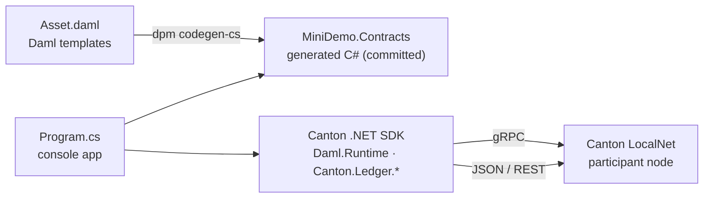

# Canton .NET SDK — Mini Demo

> The smallest program that takes a Canton smart contract from **Daml source → generated C# → a live Token Standard V2 two-step transfer**, over both the **gRPC** and the **JSON/REST** Ledger API, against a running Canton LocalNet.

<p>
  <a href="https://github.com/peacefulstudio/canton-dotnet-sdk-mini-demo/actions/workflows/ci.yaml"></a>
  
  
  
  
</p>

This repository is the **quickstart and end-to-end integration test** for the **C# / .NET SDK for Canton Network**. It is deliberately tiny: **one** Daml module and **one** console program. A new .NET developer can read it in one sitting and run it in minutes.

If you want to build C# applications that talk to a Canton ledger and Daml contracts, this is the shortest path to a working example. Copy its pattern into your own app.

## What you will see working

- **Codegen.** A Daml contract becomes idiomatic, strongly-typed C# with `dpm codegen-cs`.
- **Command submission.** Create contracts, exercise choices by contract key and through a Daml interface, and attach a disclosed contract.
- **Queries and update streams.** Read the active contract set back, with each contract's key and through a Daml interface, and observe a transaction on the offset-bounded update stream.
- **Transport independence.** The same generated bindings and the same call sites run over gRPC and JSON/REST. Alice proposes over gRPC, bob accepts over REST, and each transport then reads back what the other wrote.

The scenario is a Splice **Token Standard V2 two-step transfer**: an issuer mints 42 GOLD to alice, alice proposes a transfer to bob, bob accepts, the issuer mints 10 more GOLD to bob, and the total supply by key is checked at exactly 52.

## Architecture

You write **Daml** and a small **C# app**. Codegen bridges the two, and the SDK NuGets (all on nuget.org) carry your commands to a Canton participant node.


```mermaid
flowchart LR
    daml["Asset.daml<br/>Daml templates"] -->|"dpm codegen-cs"| bindings["MiniDemo.Contracts<br/>generated C# (committed)"]
    app["Program.cs<br/>console app"] --> bindings
    app --> sdk["Canton .NET SDK<br/>Daml.Runtime · Canton.Ledger.*"]
    sdk -->|"gRPC"| node["Canton LocalNet<br/>participant node"]
    sdk -->|"JSON / REST"| node
```

The whole difference between the two wires is one registration call in `src/MiniDemo/Program.cs`:

```diff
     .AddCantonStaticAuth(accessToken)
-    .AddLedgerClient(options => options.GrpcAddress = grpcAddress)
+    .AddRestLedgerClient(options =>
+    {
+        options.HttpAddress = jsonApiAddress;
+        options.UserId = fixture.ValidatorUserId;
+    })
```

The SDK is a thin, codegen-aware client over the Ledger API, with no in-process contract cache. Both transports register the same abstractions, so which wire a call travels down is a composition-root decision, not an application one.

## Quickstart

You need the **.NET SDK `>= 10.0.100`**, **`dpm` `>= 1.0.20`**, a **JDK 17+** and a running **Canton LocalNet** from [`canton-localnet`](https://github.com/peacefulstudio/canton-localnet) (`make up`; this repo does not start one). Docker and about 16 GB of RAM are needed for LocalNet. No private feed or credential is needed to build.

```bash
curl -sSL https://get.digitalasset.com/install/install.sh | sh -s -- 3.5.2
export PATH="$HOME/.dpm/bin:$PATH"
dpm install 3.5.2

./scripts/codegen.sh                 # Daml → C# bindings                    [make codegen]
dotnet build MiniDemo.slnx           # build the solution                    [make build]
dotnet run --project src/MiniDemo    # run the demo against LocalNet         [make run]
```

Against a stock local LocalNet no configuration is needed: every endpoint defaults to the `a-validator-1` slot, and the demo prints which endpoints it targets. On Windows, run `pwsh scripts/codegen.ps1` for the first step.

Prerequisites, configuration overrides, PQS and the full expected output are in [Quickstart details](docs/public/quickstart-details.md).

## Adopt this in your own app

Add `Daml.Runtime`, `Canton.Ledger.Grpc.Client` and/or `Canton.Ledger.Rest.Client`, and `Canton.Ledger.Kernel` from nuget.org. Write your Daml, generate bindings with `dpm codegen-cs`, register the client (`AddCantonLedger(configuration)` for gRPC, `AddRestLedgerClient(configuration.GetSection("Canton:Rest"), configuration.GetSection("Canton:Auth"))` for JSON/REST), and submit commands through the generated `TryCreateAsync` and `Try…Async` extensions.

The demo's bootstrap helper, `Peaceful.Canton.Localnet.Testing`, is a dev-time tool and not a production dependency. See [Adopt this in your own app](docs/public/adopt-in-your-own-app.md) for the steps.

## Go deeper

| Topic | Page | Read this when you want to... |
|---|---|---|
| How it works | [how-it-works.md](docs/public/how-it-works.md) | see the architecture, the codegen stage and the run-time transfer as a sequence diagram |
| Quickstart details | [quickstart-details.md](docs/public/quickstart-details.md) | check prerequisites, LocalNet configuration, run options and the expected output |
| The code, section by section | [code-walkthrough.md](docs/public/code-walkthrough.md) | see how the transport is chosen, how commands and queries are written, and what the tests cover |
| The Daml contract and the C# generated from it | [daml-and-generated-code.md](docs/public/daml-and-generated-code.md) | read the Daml model and the C# object model codegen emits from it |
| Verify on-ledger with the Canton console | [verify-with-canton-console.md](docs/public/verify-with-canton-console.md) | read the participant's own transaction stream to confirm what landed on-ledger |
| Adopt in your own app | [adopt-in-your-own-app.md](docs/public/adopt-in-your-own-app.md) | lift the pattern into your project, and find where the SDK source lives |
| Project layout and pinned versions | [project-layout-and-versions.md](docs/public/project-layout-and-versions.md) | find where everything lives and which versions are pinned |
| How the repo stays honest | [how-the-repo-stays-honest.md](docs/public/how-the-repo-stays-honest.md) | see the CI workflows that re-prove the claims made here |
| Troubleshooting | [troubleshooting.md](docs/public/troubleshooting.md) | match a symptom to its fix, or look up an exit code |

## License

Apache-2.0 © Peaceful Studio OÜ. Every hand-authored source file carries an `SPDX-License-Identifier: Apache-2.0` header; the committed generated bindings carry an `<auto-generated>` header instead.
