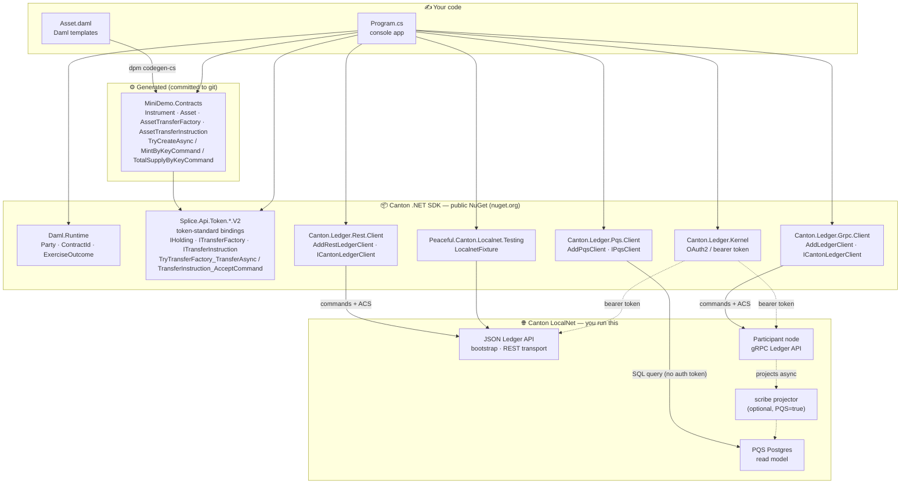
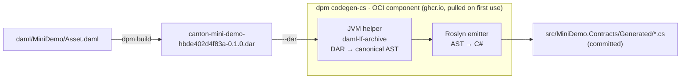
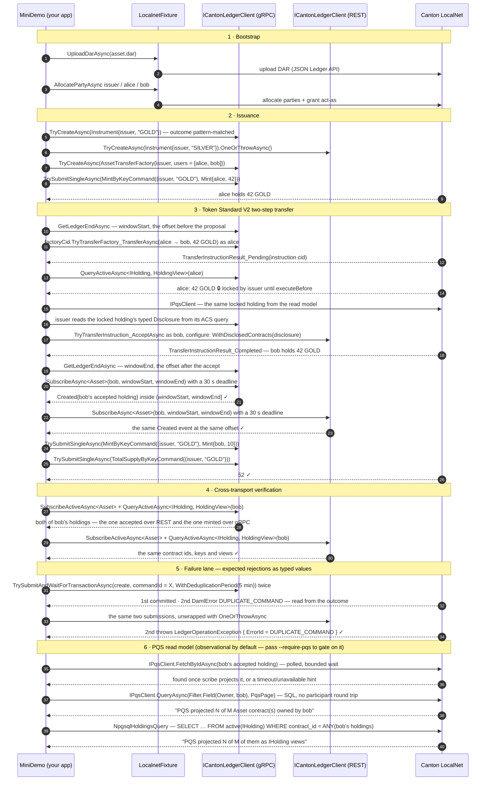

# Canton .NET SDK — Mini Demo

> The smallest possible program that takes a Canton smart contract from **Daml source → generated C# → a live Token Standard V2 two-step transfer** — over both the **gRPC** and the **JSON/REST** Ledger API — end to end, against a running Canton LocalNet.

<p>
  <a href="https://github.com/peacefulstudio/canton-dotnet-sdk-mini-demo/actions/workflows/ci.yaml"></a>
  
  
  
  
</p>

This repository is the **quickstart and end-to-end integration test** for the **C# / .NET SDK for
Canton Network**. It is deliberately tiny — **one** Daml module, **one** console program, no host
builder or telemetry weight — so the whole SDK story fits on one screen and a new developer can run
it in minutes.

It demonstrates the three things every Canton .NET application needs, plus the property that makes
them portable:

| # | Capability | In this demo |
|---|------------|--------------|
| 1 | **Codegen** — turn a Daml contract into idiomatic, strongly-typed C# | `dpm build` + `dpm codegen-cs` → `src/MiniDemo.Contracts/Generated/` |
| 2 | **Command submission** — create contracts, exercise choices by contract key and through a Daml interface, and attach a disclosed contract | generated `TryCreateAsync(...)`, `MintByKeyCommand(...)`, `TryTransferFactory_TransferAsync(...)` and `TryTransferInstruction_AcceptAsync(...)` on an `ILedgerWriter` |
| 3 | **ACS query and update stream** — read the active contract set back, with each contract's key and through a Daml interface, and observe the transfer's transaction on the offset-bounded update stream | typed `SubscribeActiveAsync<Asset>`, `QueryActiveAsync<IHolding, HoldingView>` and `SubscribeAsync<Asset>` on `ICantonLedgerClient` |
| 4 | **Transport independence** — the same bindings and the same call sites over **gRPC** and **JSON/REST** | `AddLedgerClient` or `AddRestLedgerClient`; alice proposes over gRPC, bob accepts over REST, then a cross-transport read-back of ids, keys and views |

The scenario is a Splice **Token Standard V2 two-step transfer**. An `issuer` creates the `GOLD`
`Instrument`, keyed by `(issuer, name)`, and mints 42 GOLD to `alice` by that key. Alice proposes a
transfer of all 42 to `bob` through the token standard's `TransferFactory` interface: her holding is
archived and re-created **locked** to the issuer until the transfer's deadline, next to a pending
`TransferInstruction`. Bob accepts over the other transport, attaching the locked holding as a
**disclosed contract**, and receives an unlocked 42 GOLD; both transports then observe that transaction
on the ledger's update stream, bounded by offsets and a timeout. The issuer then mints 10 GOLD to bob and
checks, with a `TotalSupply` choice that sums every holding under the instrument's key, that the
supply is exactly 52. A closing section has each transport read back the holdings the *other* one
wrote.

---

## Table of contents

- [Architecture at a glance](#architecture-at-a-glance)
- [How it works](#how-it-works)
  - [Stage 1 — Codegen: Daml → C#](#stage-1--codegen-daml--c)
  - [Stage 2 — Runtime: issue → propose → accept, across both transports](#stage-2--runtime-issue--propose--accept-across-both-transports)
- [Quickstart](#quickstart)
- [Verify on-ledger with the Canton console](#verify-on-ledger-with-the-canton-console)
- [The code, section by section](#the-code-section-by-section)
- [The Daml contract](#the-daml-contract)
- [What codegen produces](#what-codegen-produces)
- [Adopt this in your own app](#adopt-this-in-your-own-app)
- [Project layout](#project-layout)
- [Pinned versions](#pinned-versions)
- [How the repo stays honest](#how-the-repo-stays-honest)
- [The wider SDK](#the-wider-sdk)
- [Troubleshooting](#troubleshooting)
- [License](#license)

---

## Architecture at a glance

You write **Daml** and a small **C# app**. Codegen bridges the two; the SDK NuGets (all public on
nuget.org) carry your commands to a Canton participant node.


```mermaid
flowchart TB
    subgraph you["✍️  Your code"]
        daml["Asset.daml<br/>Daml templates"]
        app["Program.cs<br/>console app"]
    end

    subgraph gen["⚙️  Generated (committed to git)"]
        bindings["MiniDemo.Contracts<br/>Instrument · Asset · AssetTransferFactory · AssetTransferInstruction<br/>TryCreateAsync / MintByKeyCommand / TotalSupplyByKeyCommand"]
    end

    subgraph sdk["📦  Canton .NET SDK — public NuGet (nuget.org)"]
        runtime["Daml.Runtime<br/>Party · ContractId · ExerciseOutcome"]
        splice["Splice.Api.Token.*.V2<br/>token-standard bindings<br/>IHolding · ITransferFactory · ITransferInstruction<br/>TryTransferFactory_TransferAsync / TransferInstruction_AcceptCommand"]
        grpc["Canton.Ledger.Grpc.Client<br/>AddLedgerClient · ICantonLedgerClient"]
        rest["Canton.Ledger.Rest.Client<br/>AddRestLedgerClient · ICantonLedgerClient"]
        pqs["Canton.Ledger.Pqs.Client<br/>AddPqsClient · IPqsClient"]
        kernel["Canton.Ledger.Kernel<br/>OAuth2 / bearer token"]
        fixture["Peaceful.Canton.Localnet.Testing<br/>LocalnetFixture"]
    end

    subgraph net["🌐  Canton LocalNet — you run this"]
        json["JSON Ledger API<br/>bootstrap · REST transport"]
        node["Participant node<br/>gRPC Ledger API"]
        scribe["scribe projector<br/>(optional, PQS=true)"]
        pg["PQS Postgres<br/>read model"]
    end

    daml -->|"dpm codegen-cs"| bindings
    app --> bindings
    bindings --> splice
    app --> splice
    app --> runtime
    app --> grpc
    app --> rest
    app --> pqs
    app --> kernel
    app --> fixture
    grpc -->|"commands + ACS"| node
    rest -->|"commands + ACS"| json
    pqs -->|"SQL query (no auth token)"| pg
    node -.->|"projects async"| scribe
    scribe -.-> pg
    fixture --> json
    kernel -. "bearer token" .-> node
    kernel -. "bearer token" .-> json
```

**The SDK's design stance:** a *thin, codegen-aware client* over the Ledger API — typed wrappers,
authentication, and structured error handling — with **no in-process contract cache**. The
participant node owns authoritative state; the SDK just makes it ergonomic to reach from C#.

Both client packages register the *same* abstractions — `ILedgerClient`, `ILedgerReader`,
`ILedgerWriter`, `ILedgerStreamer` and `ICantonLedgerClient` — so which wire a call travels down is a
composition-root decision, not an application one.

---

## How it works

There are exactly two stages: a **build-time** codegen step that you run once (and re-run when the
contract changes), and a **run-time** transfer against LocalNet.

### Stage 1 — Codegen: Daml → C#

`scripts/codegen.sh` compiles the Daml package to a `.dar`, then hands that archive to
`dpm codegen-cs`. The codegen toolchain is **pulled lazily as a public OCI component** — there is no
manual `oras` step and no host .NET runtime required for the emitter itself; you only need `dpm` and
a JDK.


```mermaid
flowchart LR
    A["daml/MiniDemo/Asset.daml"] -->|"dpm build"| B["canton-mini-demo-hbde402d4f83a-0.1.0.dar"]
    subgraph OCI["dpm codegen-cs · OCI component (ghcr.io, pulled on first use)"]
        direction LR
        J["JVM helper<br/>daml-lf-archive<br/>DAR → canonical AST"] --> R["Roslyn emitter<br/>AST → C#"]
    end
    B -->|"--dar"| J
    R --> D["src/MiniDemo.Contracts/Generated/*.cs<br/>(committed)"]
```

- **`dpm build`** (uses `daml/daml.yaml`, `sdk-version 3.5.2`, `--target=2.3`) emits `daml/.daml/dist/canton-mini-demo-hbde402d4f83a-0.1.0.dar`. The package name carries a
  content hash that `scripts/compute-package-name.sh` derives from `daml/daml/**`, `daml.yaml`'s
  non-name fields, and every `*.dar` under `daml/dars/**` (the data-dependencies), then rewrites
  into `daml/daml.yaml` on every `scripts/codegen.sh` run, so editing the Daml source, editing a
  vendored DAR at the same path, or regenerating always produces a package with a fresh identity
  instead of colliding with a previously uploaded DAR of the same name and version;
  re-running `make codegen` on an unchanged source leaves the committed name unchanged.
- **`dpm codegen-cs --dar <dar> --out Generated/ --namespace MiniDemo.Asset`** (uses `codegen/daml.yaml`,
  which pins the OCI component by tag **and** digest) runs the JVM helper to decode the DAR into a
  canonical AST, then a Roslyn-based emitter writes idiomatic C# records. Output is written to a temp
  dir and atomically swapped in, so a failed run never leaves a half-written `Generated/`.
- The generated bindings are **committed to git**, so a fresh clone can `dotnet build` immediately —
  no codegen required to compile.

> **Why a JVM helper?** Decoding a `.dar` correctly across Daml-LF versions (per-version decoders,
> package-hash computation, `Dar[Ast.Package]` structure) is exactly what Digital Asset's
> `daml-lf-archive` library already does. The codegen reuses it rather than re-implementing a
> LF-protobuf parser, and it runs only at build time — it is **not** a runtime dependency of your app
> or the generated NuGets.

### Stage 2 — Runtime: issue → propose → accept, across both transports

`dotnet run --project src/MiniDemo` bootstraps once, issues an instrument, walks one Token Standard V2
two-step transfer from alice to bob, and cross-checks what each transport can see. The issuer and
alice write over gRPC and bob writes over REST, so both wires carry part of one transfer. Each section
maps to one piece of the SDK story:


```mermaid
sequenceDiagram
    autonumber
    participant App as MiniDemo (your app)
    participant Fx as LocalnetFixture
    participant G as ICantonLedgerClient (gRPC)
    participant R as ICantonLedgerClient (REST)
    participant Net as Canton LocalNet

    Note over App,Net: 1 · Bootstrap
    App->>Fx: UploadDarAsync(asset.dar)
    Fx->>Net: upload DAR (JSON Ledger API)
    App->>Fx: AllocatePartyAsync issuer / alice / bob
    Fx->>Net: allocate parties + grant act-as

    Note over App,Net: 2 · Issuance
    App->>G: TryCreateAsync(Instrument{issuer, "GOLD"}) — outcome pattern-matched
    App->>R: TryCreateAsync(Instrument{issuer, "SILVER"}).OneOrThrowAsync()
    App->>G: TryCreateAsync(AssetTransferFactory{issuer, users = [alice, bob]})
    App->>G: TrySubmitSingleAsync(MintByKeyCommand((issuer, "GOLD"), Mint{alice, 42}))
    Net-->>App: alice holds 42 GOLD

    Note over App,Net: 3 · Token Standard V2 two-step transfer
    App->>G: GetLedgerEndAsync — windowStart, the offset before the proposal
    App->>G: factoryCid.TryTransferFactory_TransferAsync(alice → bob, 42 GOLD) as alice
    Net-->>App: TransferInstructionResult_Pending(instruction cid)
    App->>G: QueryActiveAsync<IHolding, HoldingView>(alice)
    Net-->>App: alice: 42 GOLD 🔒 locked by issuer until executeBefore
    App->>Net: IPqsClient — the same locked holding from the read model
    App->>G: issuer reads the locked holding's typed Disclosure from its ACS query
    App->>R: TryTransferInstruction_AcceptAsync as bob, configure: WithDisclosedContracts(disclosure)
    Net-->>App: TransferInstructionResult_Completed — bob holds 42 GOLD
    App->>G: GetLedgerEndAsync — windowEnd, the offset after the accept
    App->>G: SubscribeAsync<Asset>(bob, windowStart, windowEnd) with a 30 s deadline
    G-->>App: Created{bob's accepted holding} inside (windowStart, windowEnd] ✓
    App->>R: SubscribeAsync<Asset>(bob, windowStart, windowEnd) with a 30 s deadline
    R-->>App: the same Created event at the same offset ✓
    App->>G: TrySubmitSingleAsync(MintByKeyCommand((issuer, "GOLD"), Mint{bob, 10}))
    App->>G: TrySubmitSingleAsync(TotalSupplyByKeyCommand((issuer, "GOLD")))
    Net-->>App: 52 ✓

    Note over App,Net: 4 · Cross-transport verification
    App->>G: SubscribeActiveAsync<Asset> + QueryActiveAsync<IHolding, HoldingView>(bob)
    G-->>App: both of bob's holdings — the one accepted over REST and the one minted over gRPC
    App->>R: SubscribeActiveAsync<Asset> + QueryActiveAsync<IHolding, HoldingView>(bob)
    R-->>App: the same contract ids, keys and views ✓

    Note over App,Net: 5 · Failure lane — expected rejections as typed values
    App->>G: TrySubmitAndWaitForTransactionAsync(create, commandId = X, WithDeduplicationPeriod(5 min)) twice
    Net-->>App: 1st committed · 2nd DamlError DUPLICATE_COMMAND — read from the outcome
    App->>R: the same two submissions, unwrapped with OneOrThrowAsync
    Net-->>App: 2nd throws LedgerOperationException { ErrorId = DUPLICATE_COMMAND } ✓

    Note over App,Net: 6 · PQS read model (observational by default — pass --require-pqs to gate on it)
    App->>Net: IPqsClient.FetchByIdAsync(bob's accepted holding) — polled, bounded wait
    Net-->>App: found once scribe projects it, or a timeout/unavailable hint
    App->>Net: IPqsClient.QueryAsync(Filter.Field(Owner, bob), PqsPage) — SQL, no participant round trip
    Net-->>App: "PQS projected N of M Asset contract(s) owned by bob"
    App->>Net: NpgsqlHoldingsQuery — SELECT … FROM active(IHolding) WHERE contract_id = ANY(bob's holdings)
    Net-->>App: "PQS projected N of M of them as IHolding views"
```

The bootstrap (DAR upload + party allocation) goes over the **JSON Ledger API** via
`LocalnetFixture`. Everything after it goes through `MiniDemoRunner` methods that take an
`ILedgerWriter` / `ICantonLedgerClient` and never learn which wire they are on; the runner only
decides *which* transport each party writes through. Everything is authenticated with the one OAuth2
bearer token minted by the fixture.

**Issuance.** The issuer creates two instruments, one per transport, to show both ways of reading a
create: `GOLD` over gRPC, pattern-matching the returned `ExerciseOutcome`, and `SILVER` over REST,
unwrapped with `OneOrThrowAsync`. The rest of the run uses `GOLD`. The `AssetTransferFactory` lists
alice and bob as observers, so both can see the factory they exercise. Alice's 42 GOLD is minted **by
key**: `Instrument.MintByKeyCommand((issuer, "GOLD"), …)` builds an `ExerciseByKeyCommand` that
`TrySubmitSingleAsync` submits, and the runner reads the one `Asset` it created from the committed
transaction.

**The two-step transfer.** Alice exercises `TransferFactory_Transfer` through the Splice
`ITransferFactory` interface. The factory archives her 42 GOLD, re-creates it with a
`HoldingV2.Lock` held by the issuer until the transfer's `executeBefore`, and creates an
`AssetTransferInstruction`; the choice returns `TransferInstructionResult_Pending` with that
instruction's id. The runner then reads the pending state twice: from the ledger's active contract set
as an `IHolding` view, and from PQS. Both must show alice's 42 GOLD 🔒 with that exact lock.

**Accepting with a disclosed contract.** Accepting archives the locked holding, so the submission
has to include it. Bob is not a stakeholder of alice's locked holding, so his submission cannot
fetch it from the ledger on its own; it carries the holding as a **disclosed contract** instead. In a real deployment
the registry that administers the instrument hands this blob to the receiver off-ledger, typically
through its off-ledger API next to the choice context. Here the issuer queries its own active
contracts with `includeDisclosure: true`, reads the typed `Disclosure` off the locked holding, and passes it
to bob in memory. Bob attaches it through the generated helper's `configure` callback
(`submission => submission.WithDisclosedContracts(disclosure)`) and submits over REST.
The choice returns `TransferInstructionResult_Completed` with bob's new, unlocked holding.

**Observing the transfer.** Reading state back is not the same as watching the ledger emit the
update. Before the proposal the runner records the ledger end with `GetLedgerEndAsync`, and again
right after bob's accept commits. It then opens `SubscribeAsync<Asset>` as bob on **each** transport
over the half-open window `(windowStart, windowEnd]` — lower bound exclusive, upper bound inclusive —
and requires the `Created` event for bob's accepted holding to arrive, at an offset inside that
window. The stream is an `IAsyncEnumerable<ContractStreamEvent<Asset>>`; because `toOffset` is set it
completes on its own, and a 30-second deadline cancels it should the participant stall. A stream that
completes without the event, delivers an event outside the window, carries a `StreamError`, or misses
the deadline throws, and the demo exits `65`.

**Total supply by key.** Contract keys are **not unique** at Daml-LF 2.3: every `Asset` of the GOLD
instrument carries the same key `(issuer, "GOLD")`, and the ledger accepts them all. The
`TotalSupply` choice on `Instrument` uses `lookupAllByKey` to fetch every holding under that key and
sums their amounts. After the issuer mints 10 GOLD to bob, the runner exercises `TotalSupply` by key
and requires exactly `52` — bob's accepted 42 plus the 10 just minted. Anything else throws, and the
demo exits `65`.

Rejecting or withdrawing a pending transfer is not part of the console run. Both are covered by the
Daml Script tests in `daml/test/` (`make daml-test`), alongside a partial transfer that leaves change
with the sender and a late accept that fails after `executeBefore`.

The fourth section is the one that cannot be faked: each transport re-reads bob's active contract set
and `IHolding` views, and must find both of bob's holdings — the one accepted over REST and the one
minted over gRPC — under the same key and with the same view. A divergence throws, naming both
transports, and the demo exits `65`.

The fifth section, `FailureLane`, shows an *expected* rejection as a typed value rather than a crash.
For each transport it submits one `create` twice under one command id, with
`CommandsSubmission.WithDeduplicationPeriod(new DeduplicationPeriod.Duration(TimeSpan.FromMinutes(5)))`.
The first submission commits; the second is rejected by the participant's command deduplication as
`DUPLICATE_COMMAND` (category `InvalidGivenCurrentSystemStateResourceExists`) — measured identically over
gRPC and over the JSON Ledger API. That rejection *is* the success condition: if the ledger accepts the
resubmission, or rejects it with any other error, the demo throws and exits `65`. Infrastructure faults
are not rejections — they escape unclassified and keep their usual exit codes (`1` / `75`). Every run mints
its own command id and asset name, so reruns on a shared LocalNet never collide. A duplicate *contract
key* is deliberately not part of this section: keys are not unique at Daml-LF 2.3, which is exactly
what `TotalSupply` relies on.

The sixth section, `PqsLane`, is different in kind: PQS (Participant Query Store) is a
Postgres-backed **read model**, populated asynchronously by a separate "scribe" projector, not a
third transport for the same synchronous guarantees gRPC and REST give. The demo always attempts it,
and by default it never *gates* on it: it polls `IPqsClient.FetchByIdAsync` for bob's accepted
holding (bounded to 120s, 500ms between polls, with a progress line after 2s), then reports what it
sees. A cold/absent database is detected instantly and is not an error; a timeout after the budget is
a hint, not a failure. Sections 1-5 already proved the ledger is correct by the time this section
runs, so by default nothing here can turn a passing run into a failing one. The pending-holding read
in section 3 follows the same rule. Pass `--require-pqs` to change that: any outcome short of full
projection — unavailable, a timeout with nothing projected, or a partial projection that is still
incomplete once the same 120s budget runs out — exits `69` instead of `0`. A partial projection keeps
polling until it completes or the budget is spent; it never fails on the first partial read. See
[The code, section by section](#the-code-section-by-section).

---

## Quickstart

### Prerequisites

| Tool | Version | Why |
|------|---------|-----|
| **.NET SDK** | `>= 10.0.100` | builds and runs the app (`dotnet --version`) |
| **dpm** (Daml Package Manager) | `>= 1.0.20` | `dpm codegen-cs` needs the `oci://` component syntax; `>= 1.0.20` verifies component digests on a cache hit |
| **JDK** | `17+` | the codegen component runs a JVM helper to decode the DAR |
| **Docker + Compose** | Docker `>= 27`, Compose `>= 2.27` | runs the Canton LocalNet stack (`make up`); budget ~16 GB RAM for it |
| **Canton LocalNet** | running | the ledger the demo talks to — this repo does **not** start one |
| **PQS** (optional) | `make up PQS=true` in `canton-localnet` | starts the scribe projector + Postgres read model for section 6; without it, section 6 detects the missing database instantly and moves on |

Install `dpm` and the pinned Daml SDK. Pin the installer to a specific release (`3.5.2` lands dpm
launcher `1.0.21`) rather than riding `latest` — a moving target, and dpm `< 1.0.20` can reuse a
stale same-name codegen component from cache without verifying its digest:

```bash
curl -sSL https://get.digitalasset.com/install/install.sh | sh -s -- 3.5.2
export PATH="$HOME/.dpm/bin:$PATH"
dpm --version               # expect 1.0.21
dpm install 3.5.2           # the SDK this demo builds against
```

Bring up a LocalNet from [`peacefulstudio/canton-localnet`](https://github.com/peacefulstudio/canton-localnet)
(`make up`). Against a **stock local LocalNet, no configuration is needed** — every endpoint defaults to
the `a-validator-1` slot (JSON Ledger API `http://localhost:11975`, gRPC `http://localhost:11901`, the
local Keycloak realm, and the demo client credentials). On startup the demo prints exactly which
endpoints it is targeting.

To target a different validator/slot, set `CANTON_LOCALNET_PROFILE`; every value below is an **optional
override** (all default to the local `a-validator-1` slot):

```bash
export CANTON_LOCALNET_PROFILE=c-validator-1    # a-validator-1 (default) … d-validator-1, sv-validator-1
export CANTON_LOCALNET_JSON_API_URL=...         # JSON Ledger API base URL (bootstrap + REST transport)
export CANTON_LOCALNET_TOKEN_URL=...            # OAuth2 token endpoint
export CANTON_LOCALNET_CLIENT_ID=...
export CANTON_LOCALNET_CLIENT_SECRET=...
export CANTON_LOCALNET_AUDIENCE=...             # optional
export CANTON_LOCALNET_SCOPE=...                # optional
export CANTON_LOCALNET_LEDGER_GRPC=...          # gRPC Ledger API (default http://localhost:11901, the a-validator-1 port)
export CANTON_LOCALNET_VALIDATOR_USER_ID=...    # set only when the validator's ledger user isn't the default
export CANTON_LOCALNET_A_VALIDATOR_1_PQS_CONNECTION_STRING=...  # PQS Postgres connection string (default targets the local a-validator-1 slot's PQS database)
```

The concrete values are printed by `canton-localnet`'s `make up`. The demo targets a
**single-synchronizer** validator (one Daml module, one program). For a non-default slot the gRPC address
still defaults to the `a-validator-1` port, so set `CANTON_LOCALNET_LEDGER_GRPC` (e.g.
`http://localhost:13901` for `c-validator-1`) and `CANTON_LOCALNET_VALIDATOR_USER_ID` to that
validator's ledger user — otherwise party setup fails with `USER_NOT_FOUND`.

> **No private feed, token, or credential is needed to build.** Every SDK package restores from
> **public nuget.org** — `NuGet.config` lists `nuget.org` only. `dotnet restore` / `dotnet build`
> work on a clean machine with zero secrets.

### Run it

Three commands (each also wrapped by a `make` target):

```bash
./scripts/codegen.sh                 # 1. dpm build → dpm codegen-cs → (re)generate C# bindings   [make codegen]
dotnet build MiniDemo.slnx           # 2. build the .NET solution                                  [make build]
dotnet run --project src/MiniDemo    # 3. run the integration test (needs a running LocalNet; env vars optional) [make run]
```

Pass `--require-pqs` to step 3 (`dotnet run --project src/MiniDemo -- --require-pqs`, or
`REQUIRE_PQS=1 make run`) to make section 6 gate on PQS reaching full projection — see
[Troubleshooting](#troubleshooting) for what that changes about the exit code.

**Windows:** run step 1 as `pwsh scripts/codegen.ps1` — a faithful PowerShell twin of `codegen.sh`
(Windows PowerShell 5.1 or PowerShell 7+); steps 2 and 3 are byte-for-byte identical. The `make`
targets assume a Unix shell, so on Windows call the three commands directly.

On a fresh clone the generated **bindings** are already committed, so `dotnet build` compiles without
codegen. The compiled **DAR is not committed** (`.daml/` is gitignored), so `dotnet run` needs step 1
first (or at least `dpm build`, or `MINI_DEMO_DAR` pointing at an existing `.dar`). Re-run step 1
whenever you change `Asset.daml`.

<details>
<summary><b>Expected output</b> (party IDs, contract IDs and ledger offsets differ per run and are shortened with <code>…</code> here; the amounts do not)</summary>

```text
Targeting Canton LocalNet (AValidator1). Values default to a local LocalNet; override any via CANTON_LOCALNET_* env vars:
  CANTON_LOCALNET_JSON_API_URL   http://localhost:11975/
  CANTON_LOCALNET_LEDGER_GRPC    http://localhost:11901
  CANTON_LOCALNET_TOKEN_URL      http://localhost:8082/realms/AValidator1/protocol/openid-connect/token
  CANTON_LOCALNET_CLIENT_ID      a-validator-1-validator
== 1. Bootstrap ==
Uploading DAR: …/daml/.daml/dist/canton-mini-demo-hbde402d4f83a-0.1.0.dar
DAR upload outcome: Uploaded
issuer = issuer-89189719140d::1220…
alice  = alice-89189719140d::1220…
bob    = bob-89189719140d::1220…
Granted act-as (issuer/alice/bob) to ledger user … (leased — revoked when the run completes or fails)

== 2. Issuance — instruments, a transfer factory and a mint by key ==
  create   Instrument(issuer, GOLD) over gRPC -> 00…
             (TryCreateAsync, outcome pattern-matched)
  create   Instrument(issuer, SILVER) over REST -> 00…
             (TryCreateAsync(...).OneOrThrowAsync)
  create   AssetTransferFactory(issuer, users = alice, bob) over gRPC -> 00…
  mint     42 GOLD to alice, by key (issuer-89189719140d::1220…, GOLD) over gRPC -> 00…

== 3. Token Standard V2 two-step transfer — alice -> bob ==
  propose  alice -> bob, 42 GOLD via TransferFactory_Transfer over gRPC -> pending 00…
             (requestedAt 2026-10-01 10:03:20Z <= now < executeBefore 2026-10-01 11:04:20Z)
  acs      alice: 42 GOLD 🔒  locked by issuer-89189719140d::1220… until 2026-10-01 11:04:20Z (transfer to bob-89189719140d::1220…)
             (00…, read as an IHolding view over gRPC)
  pqs      alice: 42 GOLD 🔒  locked by issuer-89189719140d::1220… until 2026-10-01 11:04:20Z (transfer to bob-89189719140d::1220…)
             (the same pending holding, read from the Postgres read model)
  disclose issuer reads the locked holding's typed Disclosure from its gRPC ACS query (1051 bytes) and hands it to bob off-ledger
  accept   bob accepts over REST, the locked holding attached as a disclosed contract -> completed, bob holds 00…
  observe  gRPC update stream (2777, 2783] delivered Created 00… to bob at offset 2781 (1 event(s) read)
  observe  REST update stream (2777, 2783] delivered Created 00… to bob at offset 2781 (1 event(s) read)
  mint     10 GOLD to bob, by key (issuer-89189719140d::1220…, GOLD) over gRPC -> 00…
  supply   TotalSupply by key (issuer-89189719140d::1220…, GOLD) over gRPC = 52 (42 accepted by bob + 10 minted to bob)

== 4. Cross-transport verification ==
  gRPC reads back the Asset written over REST (00…): same key (issuer-89189719140d::1220…, GOLD), same IHolding view 42 GOLD
  gRPC reads back the Asset written over gRPC (00…): same key (issuer-89189719140d::1220…, GOLD), same IHolding view 10 GOLD
  REST reads back the Asset written over REST (00…): same key (issuer-89189719140d::1220…, GOLD), same IHolding view 42 GOLD
  REST reads back the Asset written over gRPC (00…): same key (issuer-89189719140d::1220…, GOLD), same IHolding view 10 GOLD

== 5. Failure lane — expected rejections as typed values ==
  gRPC submit create Asset(issuer, issuer, DEDUP-gRPC-…) as command mini-demo-dedup-gRPC-… (deduplicated for 5 min)
  gRPC committed
  gRPC submit the same command id again (rejection read from the DamlError outcome)
  gRPC rejected as expected: DUPLICATE_COMMAND (category InvalidGivenCurrentSystemStateResourceExists)
  REST submit create Asset(issuer, issuer, DEDUP-REST-…) as command mini-demo-dedup-REST-… (deduplicated for 5 min)
  REST committed
  REST submit the same command id again (rejection read from the LedgerOperationException)
  REST rejected as expected: DUPLICATE_COMMAND (category InvalidGivenCurrentSystemStateResourceExists)

== 6. PQS read model ==
  PQS projected 2 of 2 Asset contract(s) owned by bob (WHERE owner = ? and LIMIT pushed into Postgres — the participant is never queried):
             00… name=GOLD amount=42.0000000000
             00… name=GOLD amount=10.0000000000
  PQS projected 2 of 2 of them as IHolding views (the interface view, decoded without naming the Asset template):
             00… owner=bob-89189719140d::1220…, admin=issuer-89189719140d::1220…, instrument=GOLD, amount=42.0000000000
             00… owner=bob-89189719140d::1220…, admin=issuer-89189719140d::1220…, instrument=GOLD, amount=10.0000000000

Done — one set of generated bindings drove 2 transports (gRPC and REST) through a Token Standard V2 two-step transfer against one ledger.
```

On startup the program prints the LocalNet endpoints it will target; if LocalNet isn't reachable it
prints `Canton LocalNet is not reachable (…)` with a hint and exits `1` — it never silently no-ops.

Only the identifiers and timestamps move between runs. Every run allocates fresh parties — note the
per-run suffix on `issuer-…` / `alice-…` / `bob-…` — so the contract ids and those suffixes differ
each time, but the amounts are fixed: alice's pending holding is always **42 GOLD 🔒**, the total
supply is always **52**, section 3 always prints **2** `observe` lines (one per transport, with the same offset), and section 4 always prints **4** lines — two readers × two of bob's
holdings, each with a matching key and view. A different amount or count is a real divergence, not
run-to-run noise. The `requestedAt` line sits one minute before the proposal and `executeBefore` one
hour after it; the minute absorbs clock skew between your machine and the participant.

Section 6 and the `pqs` line of section 3 are the exception to that rule by default: they are
**observational, not asserted**. If PQS is unreachable they print a one-line "not available" hint
and move on; if it's reachable but still catching up, they poll for up to 120s and report a partial
count or a timeout hint instead of failing. Neither a hint, a partial count, nor the projected count
itself changes the exit code — only sections 1-5 do that, unless `--require-pqs` is passed. With that
flag, an unavailable or a timed-out-with-nothing outcome exits `69` right away; a partial outcome keeps
polling until it either reaches `N of N` on both queries or exhausts the same 120s budget, and in the
latter case also exits `69` instead of `0`.

Reproducing this output needs LocalNet [`v0.8.4-1`](https://github.com/peacefulstudio/canton-localnet)
or later — earlier releases grant PQS read access to the validator party only, so PQS times out against
this demo's fresh parties instead of projecting anything.
</details>

---

## Verify on-ledger with the Canton console

The demo prints the contract IDs it creates, but you don't have to take its word for it — you can read
the **participant's own transaction stream** and confirm the mint, the proposal and the acceptance
actually landed on-ledger. The Daml SDK ships a Canton console for exactly this: `dpm canton-console`.

> Needs a running LocalNet (the same single-sync **a-validator-1** the demo targets by default) and
> `dpm >= 1.0.20`. None of this is required to run the demo — it's a verification aid.

**1. Write a console config** pointing at a-validator-1's Ledger + Admin APIs (this is LocalNet's own
console config with the container address swapped for `localhost`):

```bash
cat > canton-console.conf <<'CONF'
canton.features.enable-testing-commands = yes
canton.remote-participants.a-validator-1 {
  ledger-api { address = "localhost", port = 11901 }
  admin-api  { address = "localhost", port = 11902 }
  token = ${A_VALIDATOR_1_VALIDATOR_USER_TOKEN}
}
CONF
```

**2. Mint a bearer token** into that env var (a-validator-1's Keycloak realm — these are LocalNet's
fixed local-dev credentials, the same ones the demo defaults to, not secrets). It is piped straight
into the variable so it never reaches your terminal or shell history:

```bash
export A_VALIDATOR_1_VALIDATOR_USER_TOKEN=$(
  curl -fsS http://localhost:8082/realms/AValidator1/protocol/openid-connect/token \
    -d grant_type=client_credentials -d scope=openid \
    -d client_id=a-validator-1-validator \
    -d client_secret=AL8648b9SfdTFImq7FV56Vd0KHifHBuC \
  | sed -n 's/.*"access_token":"\([^"]*\)".*/\1/p')
```

**3. Open the console:**

```bash
dpm canton-console -c canton-console.conf
```

**4. Inside the console**, resolve the participant and the parties the demo printed, then read the
active contracts and the transaction history:

```scala
val p = participants.remote.find(_.name == "a-validator-1").get

// The demo allocates parties as "issuer-<hex>::<namespace>". Match the "issuer-" hint
// (unique to the demo), then take bob from the same run so LocalNet's own wallet
// parties are skipped. Run the demo more than once and several demo parties pile up on
// the ledger — paste the exact ids from the run you care about.
val parties = p.parties.list().map(_.party)
val issuer  = parties.filter(_.toProtoPrimitive.startsWith("issuer-")).head
val bob     = parties.filter(_.toProtoPrimitive == "bob-" + issuer.toProtoPrimitive.stripPrefix("issuer-")).head

// (a) What bob owns now — the accepted holding and the one minted to him:
p.ledger_api.state.acs.of_party(bob).foreach { c =>
  println(s"${c.templateId.entityName}  ${c.contractId.take(16)}…")
}

// (b) The transactions that produced them (issuer is a signatory on every contract):
val end = p.ledger_api.state.end()
p.ledger_api.updates.transactions(Set(issuer), 100, endOffsetInclusive = Some(end)).foreach { w =>
  val tx = w.transaction
  println(s"workflow=${tx.workflowId}  (${tx.events.size} event(s))")
  tx.events.foreach { e =>
    e.event.created.foreach (c => println(s"   + created  ${c.contractId.take(16)}…"))
    e.event.archived.foreach(a => println(s"   - archived ${a.contractId.take(16)}…"))
  }
}
```

The contract IDs vary per run, but match the ones the demo just printed. In (a), bob's active
contract set lists two `Asset` contracts: the 42 GOLD he accepted and the 10 GOLD minted to him. In
(b), read the issuer's history top to bottom:

- three single-event transactions create the `GOLD` and `SILVER` instruments and the
  `AssetTransferFactory`;
- the mint to alice creates her unlocked `Asset`;
- the proposal **archives** that `Asset` and **creates** two contracts: the locked `Asset` and the
  `AssetTransferInstruction`;
- the acceptance **archives** the instruction and the locked `Asset`, and **creates** bob's unlocked
  `Asset`;
- the mint to bob creates his second `Asset`;
- the failure lane's two committed creates follow.

`TotalSupply` is a nonconsuming choice that creates nothing, so it leaves no event in this view. The
proposal went over gRPC and the acceptance over REST, but nothing here says so: the ledger records the
same commands whichever transport carried them, which is why the demo's own cross-check works on the
read side. Type `exit` to leave.

> The bearer expires after a few minutes; if a command returns `UNAUTHENTICATED`, re-run step 2 and
> reconnect. This targets **a-validator-1** — for another slot use its port (`b`=`12901`, `c`=`13901`,
> `d`=`14901`), Keycloak realm (`BValidator1`…), and client id/secret.

---

## The code, section by section

`Program.cs` is a thin entry point that reads the environment, prints the target-endpoint banner,
builds one service provider per transport, and hands off to `MiniDemoRunner`, which walks the
issuance and the two-step transfer step by step; `AssetAcsQuery` owns the keyed ACS query,
`HoldingQuery` the `IHolding` interface query (with each holding's lock) and the typed `Disclosure`
read that feeds the acceptance, and `ExerciseOutcomeExtensions` the `Unwrap` helper. A transport is nothing more than
`LedgerTransport(string Name, string Endpoint, ICantonLedgerClient Client, ResultStyle ResultStyle)` —
the runner never learns which wire it holds. Three small modules keep the wiring honest: `LocalnetPreflight` builds that startup
banner and classifies "LocalNet unreachable" socket errors into a friendly hint (so an unreachable
ledger exits `1` with guidance, never a silent no-op); `LedgerEndpoint` resolves both addresses — the
gRPC one from `CANTON_LOCALNET_LEDGER_GRPC` (default `http://localhost:11901`), the JSON Ledger API
one from the same `EndpointDiscovery` the bootstrap already uses, so the REST transport needs no new
environment variable; and `DarLocator` finds the built `.dar` (`MINI_DEMO_DAR` if set, else the most
recent archive under `daml/.daml/dist/`). Each console section maps to an SDK concept:

| Console section | What it exercises | Key SDK surface |
|-----------------|-------------------|-----------------|
| `1. Bootstrap` | Upload the DAR and allocate `issuer` / `alice` / `bob`, grant act-as rights (permission to submit commands as those parties) as a lease revoked when the run completes or fails | `LocalnetFixture.UploadDarAsync`, `AllocatePartyAsync`, `GrantUserRightsLeaseAsync` |
| `2. Issuance` | Create the `GOLD` instrument over gRPC and the `SILVER` one over REST (the two ways to read a create), the `AssetTransferFactory` with alice and bob as observers, and mint 42 GOLD to alice **by key** | generated `TryCreateAsync`; `Instrument.MintByKeyCommand` submitted with `TrySubmitSingleAsync`; `ExerciseOutcome<T>` pattern match vs `OneOrThrowAsync` |
| `3. Token Standard V2 two-step transfer` | Alice proposes over gRPC through the `ITransferFactory` interface; the runner reads her locked holding from the ACS and from PQS; the issuer reads its typed `Disclosure`; bob accepts over REST with that holding **disclosed**; both transports observe bob's `Created` event on the offset-bounded update stream; the issuer mints 10 GOLD to bob and checks `TotalSupply` by key is `52` | generated `TryTransferFactory_TransferAsync`; `QueryActiveAsync<IHolding, HoldingView>`; `TryTransferInstruction_AcceptAsync(configure: …WithDisclosedContracts)`; `QueryActiveAsync(includeDisclosure: true)`; `GetLedgerEndAsync`; `SubscribeAsync<Asset>(submitter, fromOffset, toOffset)`; `UpdateStreamObserver.ObserveCreatedAsync`; `Instrument.TotalSupplyByKeyCommand` + `ExerciseResult<decimal>` |
| `4. Cross-transport verification` | Each transport re-reads bob's keyed ACS and `IHolding` views and must see both of his holdings, under the same key and with the same view | `MiniDemoRunner.VerifyEveryTransportSeesEveryAssetAsync`, which throws naming both transports on any divergence (exit `65`) |
| `5. Failure lane` | Submit one `create` twice under one command id inside a 5-minute deduplication window; the second submission must come back as `DUPLICATE_COMMAND`, read as a typed `DamlError` on gRPC and as a `LedgerOperationException` on REST | `CommandsSubmission.WithDeduplicationPeriod`, `DeduplicationPeriod.Duration`, `TrySubmitAndWaitForTransactionAsync`; `FailureLane.RunAsync` (exit `65` if the ledger accepts the duplicate) |
| `6. PQS read model` | Poll the PQS read model for bob's accepted holding, then run a filtered/paged SQL query and an `IHolding` interface query against it | `AddPqsClient(options)`, resolved as `IPqsClient`; `PqsLane.RunAsync`; `NpgsqlHoldingsQuery` |

The client comes from dependency injection, and that is where the transport is decided. `Program.cs`
builds one container per transport. Register the token provider **before** the client — both
registrations fall back to `ITokenProvider.None` for any provider not already registered, so the order
matters:

```csharp
using Canton.Ledger.Abstractions;
using Canton.Ledger.Grpc.Client;
using Canton.Ledger.Kernel.Authentication;
using Canton.Ledger.Pqs.Client;
using Canton.Ledger.Rest.Client;
using Microsoft.Extensions.DependencyInjection;

await using var grpcServices = new ServiceCollection()
    .AddCantonStaticAuth(accessToken)
    .AddLedgerClient(options => options.GrpcAddress = grpcAddress)
    .BuildServiceProvider();

await using var restServices = new ServiceCollection()
    .AddCantonStaticAuth(accessToken)
    .AddRestLedgerClient(options =>
    {
        options.HttpAddress = jsonApiAddress;
        options.UserId = fixture.ValidatorUserId;
    })
    .BuildServiceProvider();

await using var pqsServices = new ServiceCollection()
    .AddPqsClient(options => options.ConnectionString = pqsConnectionString)
    .BuildServiceProvider();

LedgerTransport[] transports =
[
    new("gRPC", grpcAddress, grpcServices.GetRequiredService<ICantonLedgerClient>()),
    new("REST", jsonApiAddress, restServices.GetRequiredService<ICantonLedgerClient>(), ResultStyle.OrThrow),
];

var pqsClient = pqsServices.GetRequiredService<IPqsClient>();
```

`AddPqsClient` needs no bearer token — PQS is a direct Postgres connection, not an authenticated
Ledger API call, so it is registered in its own container rather than alongside
`AddCantonStaticAuth`.

Everything downstream of that array is shared. The whole difference between reaching Canton over gRPC
and reaching it over HTTP is the registration call:

```diff
     .AddCantonStaticAuth(accessToken)
-    .AddLedgerClient(options => options.GrpcAddress = grpcAddress)
+    .AddRestLedgerClient(options =>
+    {
+        options.HttpAddress = jsonApiAddress;
+        options.UserId = fixture.ValidatorUserId;
+    })
```

`HttpAddress` is the **JSON Ledger API** base URL — not `GrpcAddress`, and not the gRPC port.
`UserId` is optional: left unset, the participant derives it from the token; the demo passes
`fixture.ValidatorUserId`, the same ledger user it granted act-as rights to during bootstrap. Both
transport packages ship on the same `0.6.0-preview.3` line — preview software, pinned centrally (see
[Pinned versions](#pinned-versions)).

Either call registers one adapter resolvable as the same five service types — `ICantonLedgerClient`,
`ILedgerClient`, `ILedgerReader`, `ILedgerWriter` and `ILedgerStreamer`. The gRPC package registers
them as singletons, so the channel is shared and the container owns it — dispose the service provider, not the client (the demo does so with `await using`); the REST package registers
them as transients over a named `HttpClient`. The demo resolves `ICantonLedgerClient` — still an
abstraction, not a transport type, and the narrowest one that carries the interface-view query
`QueryActiveAsync<TInterface, TView>` alongside the `ILedgerClient` writes and reads. The runner
methods that need only part of it still take `ILedgerWriter` or `ILedgerClient`, so the transport
stays a detail of the composition root.

The demo uses `AddCantonStaticAuth` because its token comes from the LocalNet fixture; a real service
uses `AddCantonAuth(configuration)` for OAuth2 client credentials, or `AddCantonLedger(configuration)`
to wire client and auth together from the canonical `Canton:Ledger` and `Canton:Auth` configuration
sections.

The command-submission calls read almost exactly like the domain language — and the parameter type is
the point, because it is what makes them portable. These are the runner's issuance and transfer
methods, with their console output and some checks elided:

```csharp
internal static async Task<ContractId<Instrument>> CreateInstrumentAsync(
    ILedgerWriter ledgerClient, Instrument instrument, string transportName, ResultStyle style, CancellationToken ct)
{
    return style switch
    {
        ResultStyle.OutcomePatternMatch => MatchCreated(await ledgerClient.TryCreateAsync(instrument, cancellationToken: ct)),
        ResultStyle.OrThrow => await ledgerClient
            .TryCreateAsync(instrument, cancellationToken: ct)
            .OneOrThrowAsync(nameof(CreateInstrumentAsync)),
    };
}

private static ContractId<Instrument> MatchCreated(ExerciseOutcome<ContractId<Instrument>> outcome) => outcome switch
{
    ExerciseOutcome<ContractId<Instrument>>.One created => created.Result,
    _ => outcome.Unwrap(nameof(CreateInstrumentAsync)),
};

internal static async Task<ContractId<Asset>> MintByKeyAsync(
    ILedgerWriter ledgerClient, AssetKey instrumentKey, Party issuer, Party owner, decimal amount, CancellationToken ct)
{
    var outcome = await ledgerClient.TrySubmitSingleAsync(
        Instrument.MintByKeyCommand(instrumentKey.ToDaml(), new Instrument.Mint(owner, amount)),
        new SubmitterInfo(issuer),
        workflowId: "mini-demo",
        cancellationToken: ct);
    var transaction = outcome.Unwrap(nameof(MintByKeyAsync));
    return MintResult.FromCreatedContracts(transaction.CreatedContracts).Unwrap(nameof(MintByKeyAsync)).Asset;
}

internal static async Task<ContractId<ITransferInstruction>> ProposeAsync(
    ILedgerWriter ledgerClient, ContractId<ITransferFactory> factoryCid, TransferProposal proposal, CancellationToken ct)
{
    var outcome = await factoryCid.TryTransferFactory_TransferAsync(
        ledgerClient,
        new TransferFactory_Transfer(proposal.Transfer, [proposal.Parties.Alice], NoExtraArgs),
        new SubmitterInfo(proposal.Parties.Alice),
        workflowId: "mini-demo",
        cancellationToken: ct);
    var result = outcome.Unwrap(nameof(ProposeAsync));
    if (result.Output is not TransferInstructionResult_Output.TransferInstructionResult_Pending pending)
        throw new DemoVerificationException("a two-step transfer must leave a pending transfer instruction");
    return pending.Value.TransferInstructionCid;
}

internal static async Task<ContractId<Asset>> AcceptWithDisclosureAsync(
    ILedgerWriter ledgerClient, ContractId<ITransferInstruction> instructionCid, DisclosedContract lockedHolding,
    Party bob, CancellationToken ct)
{
    var result = await instructionCid
        .TryTransferInstruction_AcceptAsync(
            ledgerClient,
            new TransferInstruction_Accept([bob], NoExtraArgs),
            new SubmitterInfo(bob),
            workflowId: "mini-demo",
            configure: submission => submission.WithDisclosedContracts(lockedHolding),
            cancellationToken: ct)
        .OneOrThrowAsync(nameof(AcceptWithDisclosureAsync));
    var completed = (TransferInstructionResult_Output.TransferInstructionResult_Completed)result.Output;
    return new ContractId<Asset>(completed.Value.ReceiverHoldingCids[0].Value);
}

internal static async Task VerifyTotalSupplyAsync(
    ILedgerWriter ledgerClient, AssetKey instrumentKey, Party issuer, CancellationToken ct)
{
    var outcome = await ledgerClient.TrySubmitSingleAsync(
        Instrument.TotalSupplyByKeyCommand(instrumentKey.ToDaml(), new Instrument.TotalSupply()),
        new SubmitterInfo(issuer),
        workflowId: "mini-demo",
        cancellationToken: ct);
    var totalSupply = outcome.Unwrap(nameof(VerifyTotalSupplyAsync)).ExerciseResult<decimal>(Instrument.ChoiceTotalSupply.Name);
    if (totalSupply != 52m)
        throw new DemoVerificationException($"TotalSupply returned {totalSupply}; expected 52.");
}
```

The issuance lane creates `GOLD` through `TryCreateAsync` over gRPC and pattern-matches the returned
outcome; `SILVER` goes over REST through `TryCreateAsync(...).OneOrThrowAsync(...)` from
`Canton.Ledger.Abstractions`, which returns the value or throws a `LedgerOperationException`. The
console line under each `create` names the style, so the two are visible side by side. Every
`ContractId<T>` is one sealed type with value equality, so the cross-transport check compares the id a
transport wrote with the id every reader reports using `==`, not string comparison.

The generated extensions are declared on the abstraction, not on a transport —
`TryCreateAsync(this ILedgerWriter client, …)` and
`TryTransferFactory_TransferAsync(this ContractId<ITransferFactory> cid, ILedgerWriter client, …)` —
so they bind to whichever adapter the container produced. No overload, no conditional, no second
code path. `TryCreateAsync` takes no `SubmitterInfo`: each template's only signatory is its `issuer`
field, so the emitter derives the acting party from the payload. The choice helpers take a
`SubmitterInfo` because a bare contract id carries no payload to derive the controller from.

`TryTransferFactory_TransferAsync` comes from the Splice token-standard bindings
(`Splice.Api.Token.Transfer.Instruction.V2`), not from this repo's codegen: `AssetTransferFactory`
implements the `TransferFactory` interface, so any wallet that speaks the token standard can drive
it through `ContractId<ITransferFactory>` without knowing the template. Its result is the typed
`TransferInstructionResult`, whose `Output` union the runner matches on `Pending`.

The acceptance goes through the generated `TryTransferInstruction_AcceptAsync` like the proposal. Its
`configure` callback receives the `CommandsSubmission` built for the call, and the runner attaches the
locked holding with `WithDisclosedContracts`. The typed `TransferInstructionResult` comes straight back,
unwrapped over REST with `OneOrThrowAsync`.

Observing the transfer takes the two ledger-end offsets the runner recorded around the proposal and
the accept, and drains the typed update stream on each transport (the logic is the same on both; only
the registered client differs):

```csharp
internal static async Task ObserveCreatedAsync(
    Func<CancellationToken, IAsyncEnumerable<ContractStreamEvent<Asset>>> openStream,
    string transportName, ContractId<Asset> expected, LedgerOffset after, LedgerOffset through,
    TimeSpan timeout, TextWriter output, CancellationToken ct)
{
    using var deadline = CancellationTokenSource.CreateLinkedTokenSource(ct);
    deadline.CancelAfter(timeout);
    try
    {
        await foreach (var streamEvent in openStream(deadline.Token).WithCancellation(deadline.Token))
        {
            switch (streamEvent)
            {
                case ContractStreamEvent<Asset>.StreamError error:
                    throw new DemoVerificationException($"the {transportName} stream ended with a fault ({error.Message})");
                case ContractStreamEvent<Asset>.Created created when created.ContractId == expected:
                    return;
            }
        }
    }
    catch (OperationCanceledException) when (deadline.IsCancellationRequested && !ct.IsCancellationRequested)
    {
        throw new DemoVerificationException($"the {transportName} stream delivered no Created event within {timeout}");
    }

    throw new DemoVerificationException($"the {transportName} stream completed without a Created {expected.Value}");
}
```

The runner opens the stream with
`ledgerClient.SubscribeAsync<Asset>(new SubmitterInfo(bob), windowStart, windowEnd, deadline.Token)`.
`windowStart` and `windowEnd` come from `GetLedgerEndAsync`. A cancellation the caller asked for
still propagates as an `OperationCanceledException` (exit `130`); only the demo's own deadline becomes
a verification failure.

The mint and the total supply go **by key**: `Instrument.MintByKeyCommand((issuer, name), …)` and
`Instrument.TotalSupplyByKeyCommand((issuer, name), …)` build an `ExerciseByKeyCommand` that
`TrySubmitSingleAsync` submits. That path is untyped: it returns an
`ExerciseOutcome<TransactionResult>`, so the mint picks the one `Asset` it created out of
`CreatedContracts`, and the total supply reads the choice's `Decimal` with `ExerciseResult<decimal>`.

Every `Try…Async` helper returns an **`ExerciseOutcome<T>`** — a structured result that
distinguishes success (`One`), a Daml validation error (`DamlError` with error-id / category /
message), an infrastructure/transport error (`InfraError`), and the empty / multiple cardinality
cases. The demo's `Unwrap` helper collapses that to "give me the one result or throw a clear
exception".

Infrastructure faults carry a `TransportStatus` you can match on, so "the network is down" is
distinguishable from "the ledger said no". This is a documentation excerpt, not something the demo
runs live:

```csharp
var diagnosis = outcome switch
{
    ExerciseOutcome<ContractId<Instrument>>.InfraError { Status: TransportStatus.Grpc { StatusCode: GrpcStatusCode.Unavailable } }
        => "the ledger is unreachable over gRPC",
    ExerciseOutcome<ContractId<Instrument>>.InfraError { Status: TransportStatus.NoResponse }
        => "no complete response: the connection failed or the deadline expired",
    ExerciseOutcome<ContractId<Instrument>>.DamlError { ErrorId: "DUPLICATE_COMMAND" }
        => "the ledger already saw this command id",
    _ => "something else",
};
```

The keyed ACS query (section 4) uses the typed
`ledgerClient.SubscribeActiveAsync<Asset>(party, cancellationToken: ct)` stream —
a snapshot of the active contract set at the current ledger end, filtered to the `Asset` template by
its generated `TemplateId`. `AssetAcsQuery` switches on the resulting `AcsSnapshotEntry<Asset>`,
handling every case explicitly. `Created` events are mapped to an `AssetSnapshot`, with the
contract key decoded through the generated `Asset.Key.KeyDecoder` into an `(issuer, name)` pair; an
`Asset` that arrives without a key, or with one that doesn't decode, throws. The terminal
`Checkpoint` — which the SDK emits once at the end of every snapshot, including an empty one —
returns the accumulated list and ends the stream. A `StreamError` (transport failure), an
`Unclassified` event (one the SDK couldn't map to `Asset`), and any unrecognised entry type all
throw rather than being silently dropped, so a codegen/package-id mismatch surfaces immediately
instead of showing up as a missing contract. A stream that ends with neither terminal marker throws
as well, since that snapshot is truncated and returning it would be indistinguishable from a
complete one.

The `acs` line of section 3 reads holdings a second way, through the Splice token-standard
`IHolding` interface that `Asset` implements: `HoldingQuery` calls
`ICantonLedgerClient.QueryActiveAsync<IHolding, HoldingView>(alice)`, which drains an interface-filtered
ACS snapshot into a list of `InterfaceContract<IHolding, HoldingView>`. The runner requires exactly
one locked holding owned by alice: `42` units of the instrument `(issuer, "GOLD")`, locked by the
issuer until the transfer's `executeBefore`, with the context `transfer to <bob>`. That is exactly
what the Daml `interface instance` computes from the `lock` field. The `pqs` line checks the same
view read from PQS. Section 4 reuses the query for bob's holdings. A stream fault or an unclassified
row surfaces there as a `LedgerOperationException`, the SDK's own contract for this method.

`AssetAcsQuery` needs no transport branch for the same reason the submission code doesn't:
`ILedgerStreamer` is one contract and both packages implement it, yielding the same
`AcsSnapshotEntry<Asset>` union. Over REST the update stream is paginated underneath — windows of
`StreamWindowLimit` entries (default `200`, matching Canton's `http-list-max-elements-limit`), each
bounded by `StreamWindowIdleTimeout` (default `250ms`) — and faults arrive in band as terminal stream
errors, the way gRPC has always reported them. The ACS snapshot pages the same way: it reads
`StreamWindowLimit`-sized pages at the same offset until the participant returns none left, so the
pages together are one consistent snapshot rather than a single unbounded read, and a page that fails
ends the stream with an in-band `StreamError` after the entries already read (see
[Troubleshooting](#troubleshooting)).

Section 4 is `VerifyEveryTransportSeesEveryAssetAsync`. For each transport it reads bob's keyed
active contract set and his `IHolding` views, and checks that both of his holdings — the one accepted
over REST and the one minted over gRPC — are in both, under the key it was written with, with the same payload and the same view the
first transport reported. A missing contract or view, a different key, or a different payload or view
throws a `DemoVerificationException`, naming both transports and the contract, and the demo exits
`65`. A disagreement between the wires is therefore a hard failure, not a line of output nobody
reads.

Section 6, `PqsLane`, queries the same generated `Asset` bindings against a different kind of surface:
`IPqsClient` is **not** an `ILedgerClient` — it has no `Create`/`Exercise`, no streaming subscription,
and only ever sees the current active-contract snapshot the scribe projector has caught up to, not
history or as-of queries. `PqsLane.RunAsync` polls `IPqsClient.FetchByIdAsync<Asset>` for the specific
contract id of bob's accepted holding — not "any row", which would leave a cold database and an
empty one indistinguishable — bounded to 120s at a 500ms interval, with a progress line after 2s of
silence. Two outcomes short-circuit that wait and print a hint instead of a result: a `PostgresException`
with `SqlState 3D000` (no PQS database — `PqsAvailability.IsPqsUnavailable`, walking the exception chain
via the same `ExceptionChain.Flatten` helper `LocalnetPreflight` uses) and a connection-refused
`SocketException`, both meaning "PQS isn't running" rather than "PQS is behind". Once the probe
contract is found, it runs one `IPqsClient.QueryAsync<Asset>(Filter.Field(Owner, bob), PqsPage(...))`
and reports how many of bob's holdings PQS has projected, then one
`NpgsqlHoldingsQuery` (`SELECT … FROM active(<IHolding type id>) WHERE contract_id = ANY(…)` over Npgsql,
restricted to bob's holding ids) and reports how many of them it projected as `IHolding` views. None of this can fail the run by default: `MiniDemoRunner.RunPqsLaneAsync` wraps
the whole lane in a catch-all (everything except `OperationCanceledException`, so Ctrl+C still exits
130) that reports the failure and moves on — so a PQS error `PqsAvailability` doesn't recognize can't
reach `DemoExitCode` unless `--require-pqs` is set. With that flag, an unavailable/timeout/short
outcome throws `PqsRequirementNotMetException` — a partial projection first keeps polling
`QueryAsync<Asset>` / `NpgsqlHoldingsQuery` until it is complete or the same 120s budget
runs out — and `DemoExitCode.ForRunAsync` maps that exception to exit `69`. See
[Troubleshooting](#troubleshooting) for what each hint means.

The LocalNet-free logic is covered by **xUnit v3 unit tests** in `tests/MiniDemo.Tests/`:
`UnwrapTests` pins every `ExerciseOutcome<T>` branch of `Unwrap`; `FailureLaneTests` pins the
duplicate-command section (the rejection is observed in both result styles, an accepted or differently
rejected resubmission exits `65`, and infrastructure faults keep their usual exit codes) and
`CreateInstrumentStyleTests` the two ways to read a create; `AssetAcsQueryTests` drives
`AssetAcsQuery` through a fake ledger client (created events map to snapshots with their decoded key
and accumulate in order; a terminal checkpoint ends the snapshot; stream-error, unclassified,
marker-less, keyless and undecodable-key streams throw); `TwoStepTransferTests` drives the issuance
and the transfer through a recording ledger writer (the instrument and factory creates act as the
issuer alone and list alice and bob as factory users; the mint and `TotalSupply` go by the instrument
key as the issuer; the proposal acts as alice and must return a pending instruction; the acceptance
acts as bob, carries the locked holding as a disclosed contract and must complete; a supply other than
`52` exits `65`; the pending-holding check rejects an unlocked holding or a lock with another holder,
deadline or context, and its PQS read follows the same lenient/strict rules as section 6);
`MiniDemoRunnerTests` drives the cross-transport check
through fake transports (every transport sees every asset, key and view; a missing contract or view, a
diverging key, payload or view throws, and exits `65` through `DemoExitCode`; a lone transport reads
back its own asset), and pins `RunPqsLaneAsync`'s safety net (a `null` client skips
cleanly, a query failure after the probe is found is caught and reported rather than propagated unless
`--require-pqs` is set, in which case it is wrapped into `PqsRequirementNotMetException`, and
cancellation still propagates); `DemoExitCodeTests` pins every `DemoExitCode.ForRunAsync` branch
to its exit code, including a verification failure that names a connection issue and
`PqsRequirementNotMetException` mapping to `69`;
`LedgerEndpointTests` covers both endpoint resolutions — the gRPC-address env var and its default, and
the JSON Ledger API URL from `EndpointDiscovery`; `LocalnetPreflightTests` covers the startup banner
and the socket-error "unreachable" classifier; `ExceptionChainTests` pins the shared exception-chain
walk (linear chains, `AggregateException` branches, de-duplication of a shared reference);
`PqsConnectionStringTests` covers the PQS connection-string env var and its default; and
`PqsAvailabilityTests` / `PqsLaneTests` drive the PQS lane through `FakePqsClient` and a hand-rolled
`IPqsClient` stub — the found/timeout/unavailable outcomes of the bounded wait, the projected-count
report, the "still catching up" line, and, with `--require-pqs`, throwing on an unavailable/timed-out/
still-incomplete-at-budget outcome, polling through a partial projection until it completes within the
budget, and leaving a full first-pass projection unaffected — all on millisecond-scale timeouts. `FakePqsClient.WithQueryResults`
returns its staged list unconditionally rather than applying the `PqsFilter`, so those tests stage the
set a real filtered query would return rather than exercising the filtering itself.

The Daml model has its own **Daml Script tests** in `daml/test/` (`make daml-test`): an accept moves
the locked holding to bob, a reject and a withdraw each return it to alice unlocked, an accept after
`executeBefore` fails, and a partial transfer leaves alice her change. They also pin who may act:
bob's accept fails without the disclosed holding, only bob may reject and only alice may withdraw.
The accept and reject tests check the total supply by key along the way.

---

## The Daml contract

`daml/daml/MiniDemo/Asset.daml` holds four templates. The instrument and the holding are short enough
to read in full:

```daml
template Instrument
  with
    issuer : Party
    name : Text
  where
    signatory issuer

    key (issuer, name) : (Party, Text)
    maintainer key._1

    nonconsuming choice Mint : ContractId Asset
      with
        owner : Party
        amount : Decimal
      controller issuer
      do
        create Asset with issuer; owner; name; amount; lock = None

    nonconsuming choice TotalSupply : Decimal
      controller issuer
      do
        holdings <- lookupAllByKey @Asset (issuer, name)
        pure $ sum $ map (\(_, holding) -> holding.amount) holdings

template Asset
  with
    issuer : Party
    owner : Party
    name : Text
    amount : Decimal
    lock : Optional HoldingV2.Lock
  where
    signatory issuer
    observer owner
    ensure amount > 0.0

    key (issuer, name) : (Party, Text)
    maintainer key._1

    interface instance HoldingV2.Holding for Asset where
      view = HoldingV2.HoldingView with
        account = ownerAccount owner
        instrumentId = HoldingV2.InstrumentId with
          admin = issuer
          id = name
        amount
        lock
        meta = emptyMetadata
```

The other two implement the Splice token-standard transfer interfaces:

- **`AssetTransferFactory`** (`signatory issuer`, `observer users`) implements
  `TransferInstructionV2.TransferFactory`. Its `TransferFactory_Transfer` checks that the sender alone
  acts, that the instrument is the issuer's, and that `requestedAt <= now < executeBefore`. It then
  archives the sender's unlocked input holdings, re-creates the amount **locked** to the issuer until
  `executeBefore` (plus a change holding if the inputs cover more than the amount), and creates an
  `AssetTransferInstruction`. It returns `TransferInstructionResult_Pending`.
- **`AssetTransferInstruction`** (`signatory issuer`, `observer` sender and receiver) implements
  `TransferInstructionV2.TransferInstruction`. `TransferInstruction_Accept` (the receiver, before
  `executeBefore`) archives the locked holding and creates an unlocked one for the receiver.
  `TransferInstruction_Reject` (the receiver) and `TransferInstruction_Withdraw` (the sender) return the
  holding to the sender, unlocked.

A **single signatory** (`issuer`) on every template keeps authorization simple: the issuer's
authority comes from the factory and the instruction, which it signs, so alice and bob only ever act
as controllers.

The **key** `(issuer, name)` is maintained by the issuer and is shared by the `Instrument` and by
every `Asset` of it. Contract keys need Daml-LF 2.3, hence `--target=2.3`, and at LF 2.3 they are
**not unique**: the ledger accepts any number of active `Asset` contracts under `(issuer, "GOLD")`.
That is the point here. A holding is one of many under its instrument's key, and `lookupAllByKey`
returns all of them, which is how `TotalSupply` sums the supply without a registry of holdings. The
`Instrument` is created once per name in this demo, so exercising `Mint` or `TotalSupply` by key
always finds that one instrument.

The **factory's observers** are its `users`. Alice has to see the factory to exercise
`TransferFactory_Transfer` on it, and the demo lists bob as well. A registry would typically disclose
its factory to wallets instead.

The **interface instance** makes every `Asset` a Splice token-standard holding (`HoldingV2.Holding`,
from the `splice-api-token-holding-v2` and `splice-api-token-metadata-v1` DARs under `daml/dars/`,
declared as `data-dependencies` next to `splice-api-token-transfer-instruction-v2`). Its view says
the owner holds `amount` units of the instrument named `name`, administered by the issuer, with the
contract's `lock`, so a wallet that only speaks `IHolding` sees alice's pending 42 GOLD as locked
without knowing the `Asset` template.

---

## What codegen produces

From that one Daml module, `dpm codegen-cs` emits a small, idiomatic C# object model under
`src/MiniDemo.Contracts/Generated/MiniDemo/Asset/` (namespace `MiniDemo.Asset`, named after the Daml module):

- **`record Instrument(Party Issuer, string Name)`** and
  **`record Asset(Party Issuer, Party Owner, string Name, decimal Amount, Lock? Lock)`** — the templates
  as C# records, with `[DamlField]` attributes, `ToRecord()` / `FromRecord()` wire mapping, and static
  metadata (`TemplateId`, `PackageId`, `PackageName`, `PackageVersion`). The Daml `Optional Lock` is a
  nullable reference to the Splice-generated `Lock`.
- **`Instrument.Mint(Party Owner, decimal Amount)`** and **`Instrument.TotalSupply()`** — the choice
  arguments, with a `MintResult` projection of what `Mint` creates and each choice's `ResultDecoder`.
  Contract ids are the runtime's `ContractId<T>`, not a nested type.
- **`Instrument.Key`** / **`Asset.Key`** — a `KeyDescriptor<…, Tuple2<Party, string>>` carrying the
  key's encoder and decoder, and the by-key command builders `Instrument.MintByKeyCommand(key, arg)` /
  `Instrument.TotalSupplyByKeyCommand(key, arg)` / `ArchiveByKeyCommand(key)`, which return an
  `ExerciseByKeyCommand` to submit with `TrySubmitSingleAsync`.
- **`AssetTransferFactory(Party Issuer, IReadOnlyList<Party> Users)`** and
  **`AssetTransferInstruction(Party Issuer, Transfer Transfer, ContractId<Asset> LockedHoldingCid)`**,
  plus the interface instances: `IImplements<IHolding>` on `Asset`, `IImplements<ITransferFactory>`
  and `IImplements<ITransferInstruction>` on the other two. The Splice-generated interface types (from
  the `Splice.Api.Token.Holding.V2` and `Splice.Api.Token.Transfer.Instruction.V2` packages) carry the
  interface choices: `TryTransferFactory_TransferAsync`, `TryTransferInstruction_AcceptAsync` and the
  rest.
- **Ergonomic extension methods** so you rarely hand-build a ledger command — they are declared on
  `ILedgerWriter`, so the same call binds to either transport:
  - `TryCreateAsync(this ILedgerWriter, Instrument payload, …)` and the same for every template — the
    acting party is derived from the payload's signatory field, so there is no `SubmitterInfo` to pass.
  - `TryMintAsync` / `TryTotalSupplyAsync` on a `ContractId<Instrument>` — the same choices by contract
    id, returning a typed result (`MintResult`, `decimal`). There is no by-key `Try…Async`, which is why
    the demo submits the `…ByKeyCommand` builders through `TrySubmitSingleAsync`.
  - `MintCommand(…)` / `TotalSupplyCommand(…)` / `ArchiveCommand(…)` — the same calls as bare
    `ExerciseCommand` builders, for batching several choices into one submission. The `Try…Async`
    helpers take a `configure` callback for what they don't expose, such as disclosed contracts.
- **Template ids for PQS** — no separate generated file: `TemplateExtensions.GetTemplateId<Asset>()`
  from `Daml.Runtime` returns the `{packageName}:Module:Entity` string PQS queries expect.

The Daml `Party`, `ContractId<T>`, `Decimal`, `Text`, and the record/choice machinery all come from
the **`Daml.Runtime`** package — the "codegen runtime library" the generated code depends on.

---

## Adopt this in your own app

This demo *is* the template. To do the same in your own project:

1. **Add the SDK packages** (all on nuget.org) — take the transport you want, or both:
   ```bash
   dotnet add package Daml.Runtime
   dotnet add package Canton.Ledger.Grpc.Client   # gRPC Ledger API
   dotnet add package Canton.Ledger.Rest.Client   # JSON Ledger API — same abstractions, other wire
   dotnet add package Canton.Ledger.Kernel
   ```
2. **Write your Daml** template(s) and a `daml.yaml`.
3. **Generate bindings** with `dpm codegen-cs --dar <your.dar> --out <dir>`
   (crib `codegen/daml.yaml` for the OCI component pin, and `scripts/codegen.sh` for the build →
   codegen → commit flow).
4. **Register the client** with `AddCantonLedger(configuration)` (or `AddCantonStaticAuth` +
   `AddLedgerClient` / `AddRestLedgerClient` as the demo does) and inject `ICantonLedgerClient` when
   you query interface views, or the narrower `ILedgerClient` / `ILedgerWriter` / `ILedgerStreamer`
   otherwise. Every one of them is an abstraction both transports register, so the transport stays a
   composition-root choice.
5. **Submit commands** through the generated `TryCreateAsync` / `Try…Async` extensions on that
   client, handling the `ExerciseOutcome<T>` result — `MiniDemoRunner.cs`'s command-submission
   code and `AssetAcsQuery.cs`'s ACS-query code copy over directly, whichever transport you chose.

> The demo's **bootstrap** (DAR upload, party allocation, token) uses
> `Peaceful.Canton.Localnet.Testing` — a LocalNet/dev-time helper, **not** a production dependency. A
> real service supplies those from its own deployment (participant admin API, IAM) and keeps only the
> `Daml.Runtime` + `Canton.Ledger.*` packages at runtime.

Everything else here — the codegen script, the drift check, the central package versions, the
coverage wiring — is meant to be lifted into a real service.

---

## Project layout

```
daml/
  daml.yaml                       # sdk-version 3.5.2, Daml-LF 2.3, package canton-mini-demo-hbde402d4f83a 0.1.0
  daml/MiniDemo/Asset.daml        # Instrument, Asset (IHolding), AssetTransferFactory, AssetTransferInstruction
  dars/                           # Splice token-standard DARs: holding-v2, metadata-v1, transfer-instruction-v2
  test/                           # Daml Script tests: accept, reject, withdraw, late accept, partial transfer
codegen/
  daml.yaml                       # codegen-only project — pins the dpm-codegen-cs OCI component
scripts/
  codegen.sh                      # dpm build → dpm codegen-cs (OCI) → atomic swap into Generated/
  codegen.ps1                     # Windows (PowerShell) twin of codegen.sh
src/
  MiniDemo.Contracts/             # generated C# bindings (committed) + csproj
    Generated/MiniDemo/Asset/     #   Instrument*.cs, Asset.cs, AssetTransferFactory.cs, AssetTransferInstruction.cs
  MiniDemo/                       # the console CLI
    Program.cs                    #   entry point: read env → print banner → MiniDemoRunner
    MiniDemoRunner.cs             #   bootstrap → issuance → two-step transfer → cross-transport check
    UpdateStreamObserver.cs       #   offset-bounded, deadline-guarded SubscribeAsync<Asset> read of the transfer's Created event
    LedgerTransport.cs            #   a transport: name + endpoint + the resolved ICantonLedgerClient + its result style
    ResultStyle.cs                #   pattern-matched outcome (gRPC lane) vs OneOrThrowAsync (REST lane)
    FailureLane.cs                #   expected rejection: a duplicate command id inside its deduplication window
    AssetAcsQuery.cs              #   typed, keyed active-contract-set query → AssetSnapshot list
    AssetKey.cs                   #   the (issuer, name) contract key, to and from its Daml tuple
    HoldingQuery.cs               #   IHolding interface-view query → HoldingSnapshot list, with each lock; typed Disclosure read
    ExerciseOutcomeExtensions.cs  #   Unwrap: ExerciseOutcome<T> → the one result or a clear throw
    LocalnetPreflight.cs          #   startup endpoint banner + "unreachable" socket-error classifier
    LedgerEndpoint.cs             #   resolve the gRPC (env, default :11901) and JSON Ledger API addresses
    DarLocator.cs                 #   locate the built .dar (MINI_DEMO_DAR or newest build output)
    DemoExitCode.cs               #   maps run failures to exit codes 0 / 1 / 65 / 69 / 75 / 130
    DemoVerificationException.cs  #   the demo's own failed assertion (exit 65)
    PqsLane.cs                    #   section 6: bounded wait for PQS to project, then asset and IHolding reports
    NpgsqlHoldingsQuery.cs        #   IHolding views from PQS's active() SQL function, filtered to given contract ids
    PqsAvailability.cs            #   classifies "no PQS database" (SqlState 3D000) as unavailable
    PqsConnectionString.cs        #   PQS connection string (env var, default local a-validator-1 database)
    PqsRequirementNotMetException.cs  # --require-pqs not satisfied (exit 69)
    ExceptionChain.cs             #   shared exception-chain walk
    AmountFormat.cs               #   amount display for console output
tests/
  MiniDemo.Tests/                 # xUnit v3 unit tests: two-step transfer, AssetAcsQuery, cross-transport check, PQS lane, …
MiniDemo.slnx
Directory.Packages.props          # central SDK package versions
NuGet.config                      # nuget.org only — no private feed
Makefile                          # codegen / daml-test / build / run / clean
```

Two `daml.yaml` files exist because `dpm` rejects a single file that sets both `sdk-version` and
`components`: `daml/daml.yaml` drives `dpm build`, and `codegen/daml.yaml` pins the codegen
component for `dpm codegen-cs`.

---

## Pinned versions

| Component | Version |
|-----------|---------|
| Daml SDK (`dpm install`) | `3.5.2` |
| Daml-LF target (`--target`) | `2.3` |
| `dpm` launcher | `>= 1.0.20` (pin the installer to `3.5.2`, which lands `1.0.21`) |
| `dpm-codegen-cs` OCI component | `0.6.0-preview.3` (pinned by digest) |
| `Daml.Runtime` | `0.6.0-preview.3` |
| `Daml.Ledger.Abstractions` | `0.6.0-preview.3` |
| `Canton.Ledger.Grpc.Client` | `0.6.0-preview.3` |
| `Canton.Ledger.Rest.Client` | `0.6.0-preview.3` |
| `Canton.Ledger.Kernel` | `0.6.0-preview.3` |
| `Canton.Ledger.Pqs.Client` | `0.6.0-preview.3` |
| `Npgsql` | `10.0.3` |
| `Splice.Api.Token.Holding.V2` | `1.0.0.15-preview.3` |
| `Splice.Api.Token.Transfer.Instruction.V2` | `1.0.0.15-preview.3` |
| `Canton.Ledger.Testing` | `0.6.0-preview.3` (test projects only) |
| `Peaceful.Canton.Localnet.Testing` | `0.8.4.1` |
| `Microsoft.Extensions.DependencyInjection` | `10.0.12` |
| `Microsoft.Extensions.Logging.Console` | `10.0.12` |
| .NET SDK | `10.0` |

All versions are centrally managed (Central Package Management) in `Directory.Packages.props`, and
in `tests/Directory.Packages.props` for packages only the test projects reference.

---

## How the repo stays honest

Five GitHub Actions workflows run on GitHub-hosted runners, so what this README claims is re-proven
by CI rather than taken on trust, and every release is cut from a green run:

- **[`ci.yaml`](.github/workflows/ci.yaml)** — builds and tests the solution on every push to `main`
  and every pull request, delegating to the shared `peacefulstudio/github-actions` reusable C# CI. It
  runs a **two-OS matrix — Linux (`ubuntu-latest`, with code coverage) and Windows
  (`windows-latest`)** — so the solution is proven cross-platform on every change.
- **[`public-gate.yaml`](.github/workflows/public-gate.yaml)** — on every pull request, on
  `ubuntu-latest`, runs a leak check and a no-AI-workflows audit over the tree, then restores, builds
  (Release) and runs the unit tests against nuget.org alone.
- **[`localnet.yaml`](.github/workflows/localnet.yaml)** — runs the real demo end to end on
  `ubuntu-latest`, on demand (`workflow_dispatch`) and on every push to `main`. It starts
  `peacefulstudio/canton-localnet` v0.8.4-1 with PQS, runs `REQUIRE_PQS=1 make run`, and tears
  LocalNet down (`down --volumes`) before and after. Its runs are on the
  [LocalNet workflow page](https://github.com/peacefulstudio/canton-dotnet-sdk-mini-demo/actions/workflows/localnet.yaml).
- **[`auto-tag-release.yaml`](.github/workflows/auto-tag-release.yaml)** — after `CI` and `LocalNet`
  are both green on the tip of `main`, tags `v<Version>` (the version in
  [`Directory.Build.props`](Directory.Build.props)) once and starts the release. An open pull request
  labelled `hold-release` pauses it.
- **[`release.yaml`](.github/workflows/release.yaml)** — drafts a prerelease for the tag and publishes
  it with the matching [`CHANGELOG.md`](CHANGELOG.md) section as its notes.

The generated C# under `src/MiniDemo.Contracts/Generated/` is committed. To check it against the Daml
source yourself, run `make codegen` (needs `dpm` and a JDK, see [Prerequisites](#prerequisites)) and
confirm `git status` shows no change under that folder.

---

## The wider SDK

This demo consumes packages from the rest of the Canton .NET SDK. If you want the source:

| Package / component | Repository |
|---------------------|-----------|
| `Daml.Runtime`, `Daml.Ledger.Abstractions`, `Canton.Ledger.Grpc.Client`, `Canton.Ledger.Rest.Client`, `Canton.Ledger.Kernel`, `Canton.Ledger.Pqs.Client`, `dpm codegen-cs` | [`canton-dotnet-sdk`](https://github.com/peacefulstudio/canton-dotnet-sdk) |
| `Peaceful.Canton.Localnet.Testing`, LocalNet stack | [`canton-localnet`](https://github.com/peacefulstudio/canton-localnet) |

---

## Troubleshooting

| Symptom | Fix |
|---------|-----|
| `1. Bootstrap` fails with `Canton LocalNet is not reachable, or is not ready yet (Connection refused (localhost:11975))`, exit `1` | Start a LocalNet, or point the demo at a running one via the `CANTON_LOCALNET_*` env vars (see [Quickstart](#quickstart)). The startup banner prints the endpoints being targeted. The JSON Ledger API address serves **both** the bootstrap and the REST transport — by design, there is no separate REST endpoint variable — so one wrong value breaks both, and it fails at bootstrap before the REST section is reached. |
| Bootstrap succeeds, then `2. Issuance` fails with `Canton LocalNet is not reachable … (CreateInstrumentAsync failed (infra, status Grpc { StatusCode = Unavailable }): Error connecting to subchannel.)`, exit `1` | The gRPC leg is configured separately from the JSON one. Usually `CANTON_LOCALNET_LEDGER_GRPC` (default `http://localhost:11901`) still points at `a-validator-1` while `CANTON_LOCALNET_JSON_API_URL` targets another slot. Align the gRPC endpoint on the banner with your JSON API slot. |
| In your own app: the REST client fails while gRPC works | `options.HttpAddress` must be the **JSON Ledger API** base URL (`http://localhost:11975/` on a stock LocalNet), not `GrpcAddress` and not the gRPC port. In this demo the two share one resolved value, so a wrong one surfaces at bootstrap rather than in the REST section. |
| REST stream fails with `413 Content Too Large`, surfaced as a terminal stream error naming `StreamWindowLimit` | The participant's `http-list-max-elements-limit` is lower than the client's `StreamWindowLimit` (default `200`). Lower `options.StreamWindowLimit` to match the participant. ACS reads now page on their own, so this is usually an update or completion stream window — or a `StreamWindowLimit` set above the participant's own page-size ceiling (`10000`), which fails the ACS read's first page too. |
| `4. Cross-transport verification` fails with `Cross-transport check failed …`, exit `65` | The demo asserted something about the ledger and it did not hold; the report names the contract and the transports that disagreed. The usual cause is the two endpoints pointing at **different participants** — check that `CANTON_LOCALNET_LEDGER_GRPC` and `CANTON_LOCALNET_JSON_API_URL` on the startup banner name the same slot. If they do, the check has found a genuine disagreement between the two transports, which is what it exists to catch. |
| `3. Token Standard V2 two-step transfer` fails with `Pending-transfer check failed …` or `Total-supply check failed …`, exit `65` | The ledger did not hold what the transfer asserts: alice's holding is not locked exactly as proposed (the report names the holding and the expected lock), or `TotalSupply` by key is not `52`. A different total means `lookupAllByKey` found other holdings than the two the run left for bob. The issuer is a fresh party on every run, so its key never collides with an earlier run's; this points at the Daml model rather than leftover state. |
| `3. Token Standard V2 two-step transfer` fails with `TransferFactory_Transfer` rejected on `transfer.requestedAt` or `transfer.executeBefore` | The proposal's window is checked against the participant's ledger time. The demo sets `requestedAt` one minute before the local clock; a larger skew between your machine and the participant breaks it. Sync the clocks and re-run. |
| `5. Failure lane` fails with `Failure lane check failed …`, exit `65` | The ledger did not reject the resubmitted command id with `DUPLICATE_COMMAND` — it accepted it, or rejected it with another error id (named in the report). The lane treats the expected rejection as success, so this is a genuine change in the participant's command deduplication. |
| `dpm: command not found` / version too old | `curl -sSL https://get.digitalasset.com/install/install.sh \| sh -s -- 3.5.2`, add `~/.dpm/bin` to `PATH`, need `>= 1.0.20`. |
| Codegen fails with a JVM/Java error | Ensure a **JDK 17+** is on `PATH` (`java -version`) — the codegen component needs it to decode the DAR. |
| Committed `Generated/` differs from a fresh `make codegen` | Run `./scripts/codegen.sh` (Windows: `pwsh scripts/codegen.ps1`) locally and commit the updated `src/MiniDemo.Contracts/Generated/` files. |
| Want to point at a specific DAR | Set `MINI_DEMO_DAR=/path/to/your.dar` before `dotnet run`. |
| `6. PQS read model` prints `PQS is not available (…); skipping. Run \`make up PQS=true\` to enable it.` | Expected when the LocalNet was started without PQS — bring it up with `make up PQS=true` in `canton-localnet`, or ignore it: without `--require-pqs` this never fails the run. |
| `6. PQS read model` prints `PQS did not project the Asset contract …`, with `docker logs` / `psql` hints — or section 3 prints it with `The transfer proposal already committed` | The ledger side already passed, so the ledger is fine; the read model is lagging or `scribe` is down. Run the printed `docker logs --tail 50 pqs-a-validator-1 \| grep -i "unknown Daml package"` — if it matches, scribe is restarting to discover a newly uploaded package and will recover on its own; otherwise check the `scribe`/Postgres containers are up. |
| `6. PQS read model` reports `PQS projected N of M` with `N < M` | Scribe projects asynchronously; the ledger-side transfer already succeeded. Re-running the demo, or just waiting, resolves it — this is not a defect and does not fail the run. |
| `6. PQS read model` exits `69` (`--require-pqs was set, and PQS did not reach full projection within the bounded wait.`) | Only happens with `--require-pqs`. Sections 1-5 already passed, so the ledger is fine; PQS was unavailable, timed out with nothing projected, or stayed partial for the whole 120s budget. Same fixes as the two rows above — bring PQS up, or give `scribe` more time and re-run. |

Exit codes: `0` on a clean run, `1` when LocalNet is unreachable or the ledger reports a failure the demo does not classify, `65` when the demo's own
verification fails — a cross-transport divergence in contract ids, keys or `IHolding` views included —
and the report names what disagreed,
`75` when LocalNet is reachable but unresponsive, `130` on Ctrl+C. Anything else surfaces as an
unhandled exception, which is also non-zero. Section 6 (PQS) is observational and does not contribute
to the exit code by default; pass `--require-pqs` to change that — any outcome short of full
projection (unavailable, a timeout with nothing projected, or a partial projection still incomplete
once the 120s budget runs out) then exits `69`.

---

## License

Apache-2.0 © Peaceful Studio OÜ. Every hand-authored source file carries an
`SPDX-License-Identifier: Apache-2.0` header; the committed generated bindings carry an
`<auto-generated>` header instead.
