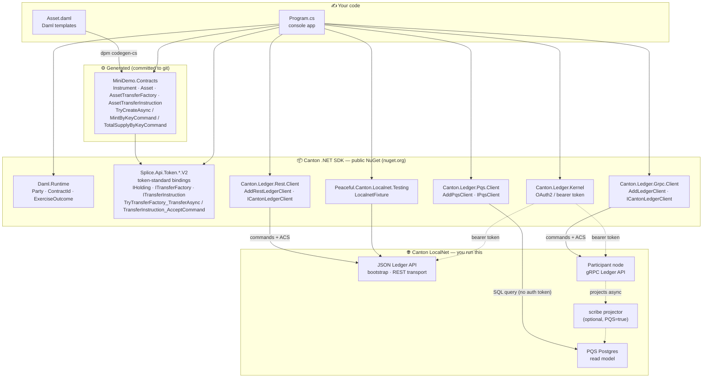
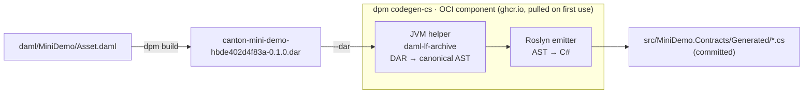
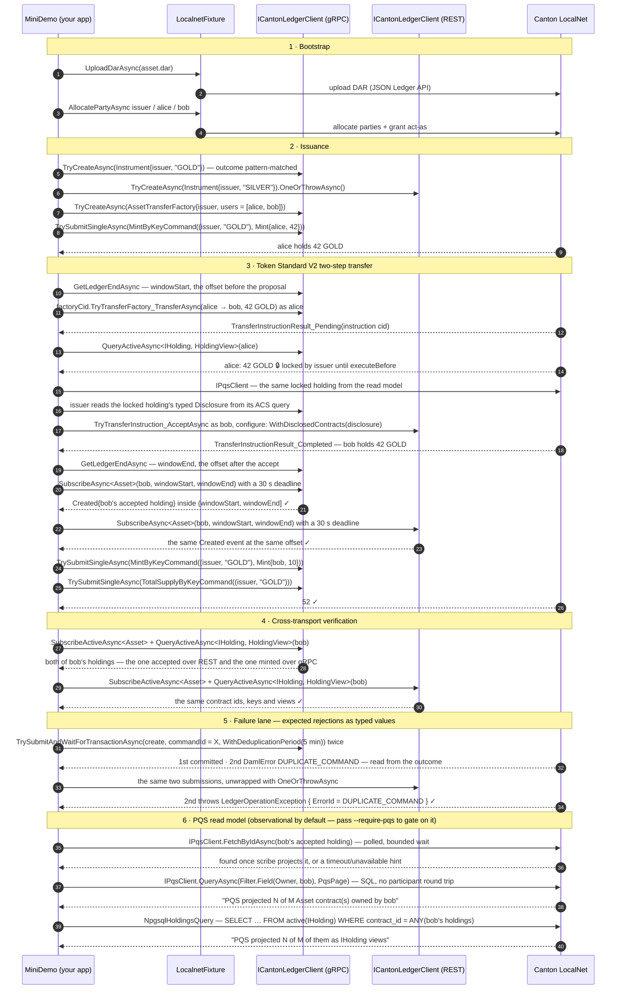

# How it works

The architecture of the demo and its two stages: build-time codegen and the run-time transfer across both transports.

Back to the [README](../../README.md).

## Architecture at a glance

You write **Daml** and a small **C# app**. Codegen bridges the two; the SDK NuGets (all public on
nuget.org) carry your commands to a Canton participant node.

**The SDK's design stance:** a *thin, codegen-aware client* over the Ledger API — typed wrappers,
authentication, and structured error handling — with **no in-process contract cache**. The
participant node owns authoritative state; the SDK just makes it ergonomic to reach from C#.

Both client packages register the *same* abstractions — `ILedgerClient`, `ILedgerReader`,
`ILedgerWriter`, `ILedgerStreamer` and `ICantonLedgerClient` — so which wire a call travels down is a
composition-root decision, not an application one.

There are exactly two stages: a **build-time** codegen step that you run once (and re-run when the
contract changes), and a **run-time** transfer against LocalNet.

## Stage 1 — Codegen: Daml → C#

`scripts/codegen.sh` compiles the Daml package to a `.dar`, then hands that archive to
`dpm codegen-cs`. The codegen toolchain is **pulled lazily as a public OCI component** — there is no
manual `oras` step and no host .NET runtime required for the emitter itself; you only need `dpm` and
a JDK.

- **`dpm build`** (uses `daml/daml.yaml`, `sdk-version 3.5.2`, `--target=2.3`) emits `daml/.daml/dist/canton-mini-demo-hbde402d4f83a-0.1.0.dar`. The package name carries a
  content hash that `scripts/compute-package-name.sh` derives from `daml/daml/**`, `daml.yaml`'s
  non-name fields, and every `*.dar` under `daml/dars/**` (the data-dependencies), then rewrites
  into `daml/daml.yaml` on every `scripts/codegen.sh` run, so editing the Daml source, editing a
  vendored DAR at the same path, or regenerating always produces a package with a fresh identity
  instead of colliding with a previously uploaded DAR of the same name and version;
  re-running `make codegen` on an unchanged source leaves the committed name unchanged.
- **`dpm codegen-cs --dar <dar> --out Generated/ --namespace MiniDemo.Asset`** (uses `codegen/daml.yaml`,
  which pins the OCI component by tag **and** digest) runs the JVM helper to decode the DAR into a
  canonical AST, then a Roslyn-based emitter writes idiomatic C# records. Output is written to a temp
  dir and atomically swapped in, so a failed run never leaves a half-written `Generated/`.
- The generated bindings are **committed to git**, so a fresh clone can `dotnet build` immediately —
  no codegen required to compile.

> **Why a JVM helper?** Decoding a `.dar` correctly across Daml-LF versions (per-version decoders,
> package-hash computation, `Dar[Ast.Package]` structure) is exactly what Digital Asset's
> `daml-lf-archive` library already does. The codegen reuses it rather than re-implementing a
> LF-protobuf parser, and it runs only at build time — it is **not** a runtime dependency of your app
> or the generated NuGets.

## Stage 2 — Runtime: issue → propose → accept, across both transports

`dotnet run --project src/MiniDemo` bootstraps once, issues an instrument, walks one Token Standard V2
two-step transfer from alice to bob, and cross-checks what each transport can see. The issuer and
alice write over gRPC and bob writes over REST, so both wires carry part of one transfer. Each section
maps to one piece of the SDK story:

The bootstrap (DAR upload + party allocation) goes over the **JSON Ledger API** via
`LocalnetFixture`. Everything after it goes through `MiniDemoRunner` methods that take an
`ILedgerWriter` / `ICantonLedgerClient` and never learn which wire they are on; the runner only
decides *which* transport each party writes through. Everything is authenticated with the one OAuth2
bearer token minted by the fixture.

**Issuance.** The issuer creates two instruments, one per transport, to show both ways of reading a
create: `GOLD` over gRPC, pattern-matching the returned `ExerciseOutcome`, and `SILVER` over REST,
unwrapped with `OneOrThrowAsync`. The rest of the run uses `GOLD`. The `AssetTransferFactory` lists
alice and bob as observers, so both can see the factory they exercise. Alice's 42 GOLD is minted **by
key**: `Instrument.MintByKeyCommand((issuer, "GOLD"), …)` builds an `ExerciseByKeyCommand` that
`TrySubmitSingleAsync` submits, and the runner reads the one `Asset` it created from the committed
transaction.

**The two-step transfer.** Alice exercises `TransferFactory_Transfer` through the Splice
`ITransferFactory` interface. The factory archives her 42 GOLD, re-creates it with a
`HoldingV2.Lock` held by the issuer until the transfer's `executeBefore`, and creates an
`AssetTransferInstruction`; the choice returns `TransferInstructionResult_Pending` with that
instruction's id. The runner then reads the pending state twice: from the ledger's active contract set
as an `IHolding` view, and from PQS. Both must show alice's 42 GOLD 🔒 with that exact lock.

**Accepting with a disclosed contract.** Accepting archives the locked holding, so the submission
has to include it. Bob is not a stakeholder of alice's locked holding, so his submission cannot
fetch it from the ledger on its own; it carries the holding as a **disclosed contract** instead. In a real deployment
the registry that administers the instrument hands this blob to the receiver off-ledger, typically
through its off-ledger API next to the choice context. Here the issuer queries its own active
contracts with `includeDisclosure: true`, reads the typed `Disclosure` off the locked holding, and passes it
to bob in memory. Bob attaches it through the generated helper's `configure` callback
(`submission => submission.WithDisclosedContracts(disclosure)`) and submits over REST.
The choice returns `TransferInstructionResult_Completed` with bob's new, unlocked holding.

**Observing the transfer.** Reading state back is not the same as watching the ledger emit the
update. Before the proposal the runner records the ledger end with `GetLedgerEndAsync`, and again
right after bob's accept commits. It then opens `SubscribeAsync<Asset>` as bob on **each** transport
over the half-open window `(windowStart, windowEnd]` — lower bound exclusive, upper bound inclusive —
and requires the `Created` event for bob's accepted holding to arrive, at an offset inside that
window. The stream is an `IAsyncEnumerable<ContractStreamEvent<Asset>>`; because `toOffset` is set it
completes on its own, and a 30-second deadline cancels it should the participant stall. A stream that
completes without the event, delivers an event outside the window, carries a `StreamError`, or misses
the deadline throws, and the demo exits `65`.

**Total supply by key.** Contract keys are **not unique** at Daml-LF 2.3: every `Asset` of the GOLD
instrument carries the same key `(issuer, "GOLD")`, and the ledger accepts them all. The
`TotalSupply` choice on `Instrument` uses `lookupAllByKey` to fetch every holding under that key and
sums their amounts. After the issuer mints 10 GOLD to bob, the runner exercises `TotalSupply` by key
and requires exactly `52` — bob's accepted 42 plus the 10 just minted. Anything else throws, and the
demo exits `65`.

Rejecting or withdrawing a pending transfer is not part of the console run. Both are covered by the
Daml Script tests in `daml/test/` (`make daml-test`), alongside a partial transfer that leaves change
with the sender and a late accept that fails after `executeBefore`.

The fourth section is the one that cannot be faked: each transport re-reads bob's active contract set
and `IHolding` views, and must find both of bob's holdings — the one accepted over REST and the one
minted over gRPC — under the same key and with the same view. A divergence throws, naming both
transports, and the demo exits `65`.

The fifth section, `FailureLane`, shows an *expected* rejection as a typed value rather than a crash.
For each transport it submits one `create` twice under one command id, with
`CommandsSubmission.WithDeduplicationPeriod(new DeduplicationPeriod.Duration(TimeSpan.FromMinutes(5)))`.
The first submission commits; the second is rejected by the participant's command deduplication as
`DUPLICATE_COMMAND` (category `InvalidGivenCurrentSystemStateResourceExists`) — measured identically over
gRPC and over the JSON Ledger API. That rejection *is* the success condition: if the ledger accepts the
resubmission, or rejects it with any other error, the demo throws and exits `65`. Infrastructure faults
are not rejections — they escape unclassified and keep their usual exit codes (`1` / `75`). Every run mints
its own command id and asset name, so reruns on a shared LocalNet never collide. A duplicate *contract
key* is deliberately not part of this section: keys are not unique at Daml-LF 2.3, which is exactly
what `TotalSupply` relies on.

The sixth section, `PqsLane`, is different in kind: PQS (Participant Query Store) is a
Postgres-backed **read model**, populated asynchronously by a separate "scribe" projector, not a
third transport for the same synchronous guarantees gRPC and REST give. The demo always attempts it,
and by default it never *gates* on it: it polls `IPqsClient.FetchByIdAsync` for bob's accepted
holding (bounded to 120s, 500ms between polls, with a progress line after 2s), then reports what it
sees. A cold/absent database is detected instantly and is not an error; a timeout after the budget is
a hint, not a failure. Sections 1-5 already proved the ledger is correct by the time this section
runs, so by default nothing here can turn a passing run into a failing one. The pending-holding read
in section 3 follows the same rule. Pass `--require-pqs` to change that: any outcome short of full
projection — unavailable, a timeout with nothing projected, or a partial projection that is still
incomplete once the same 120s budget runs out — exits `69` instead of `0`. A partial projection keeps
polling until it completes or the budget is spent; it never fails on the first partial read. See
[The code, section by section](code-walkthrough.md).
